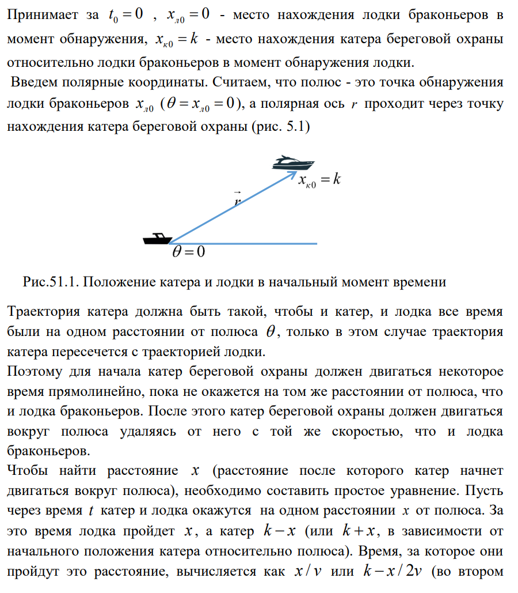
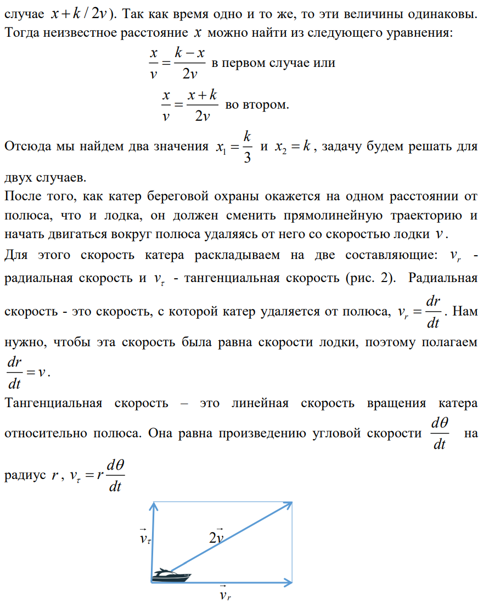
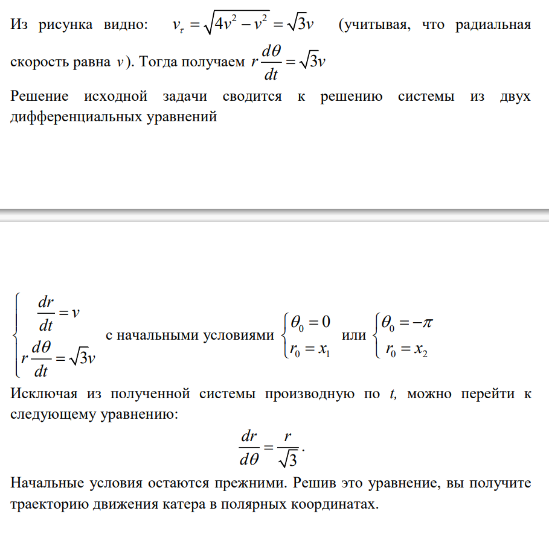

---
## Front matter
lang: ru-RU
title: 
        Лабораторная работа 2
subtitle: Задача о погоне, вариант 26
author: Маслова Анастасия Сергеевна
institute: RUDN University, Moscow, Russian Federation
date: February 17^th 2024

---

# Цель работы

Построение математических моделей для выбора правильной стратегии при решении задач поиска.

---

# Задание

На море в тумане катер береговой охраны преследует лодку браконьеров.
Через определенный промежуток времени туман рассеивается, и лодка
обнаруживается на расстоянии 15,5 км от катера. Затем лодка снова скрывается в
тумане и уходит прямолинейно в неизвестном направлении. Известно, что скорость
катера в 4,5 раза больше скорости браконьерской лодки.
1. Запишите уравнение, описывающее движение катера, с начальными
условиями для двух случаев (в зависимости от расположения катера
относительно лодки в начальный момент времени).
2. Постройте траекторию движения катера и лодки для двух случаев.
3. Найдите точку пересечения траектории катера и лодки 

---

# Выполнение работы

{#fig:001 width=70%}

#

{#fig:002 width=70%}

#

{#fig:003 width=70%}
---

# Итог

В ходе лабораторной работы я смогла построить математическую модель для выбора правильной стратегии в задаче о погоне.
---
