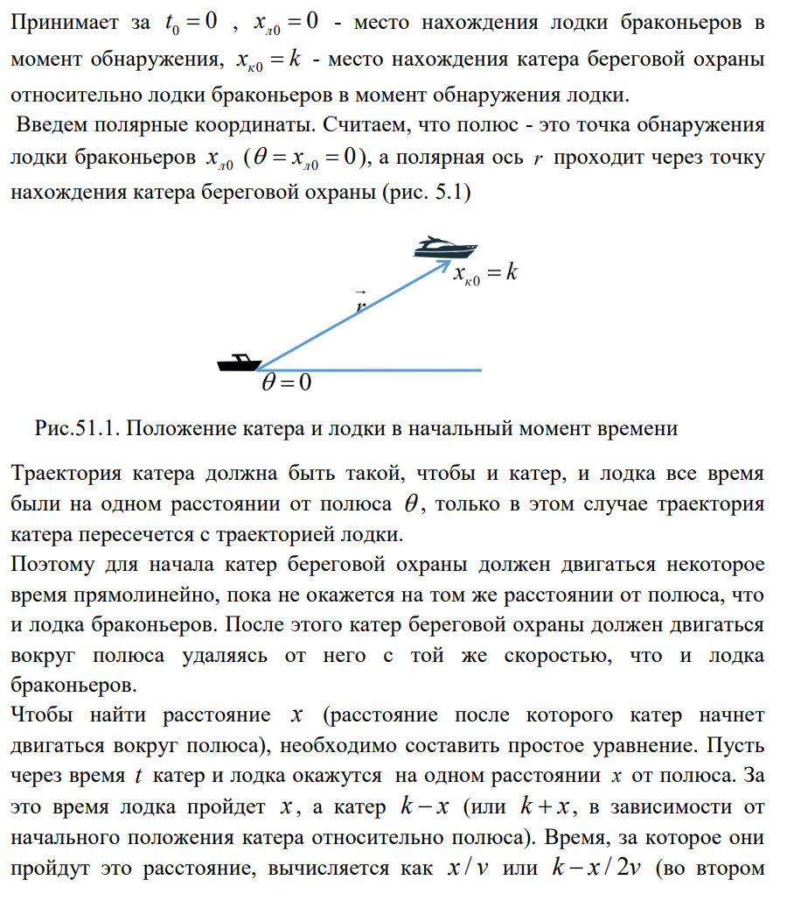
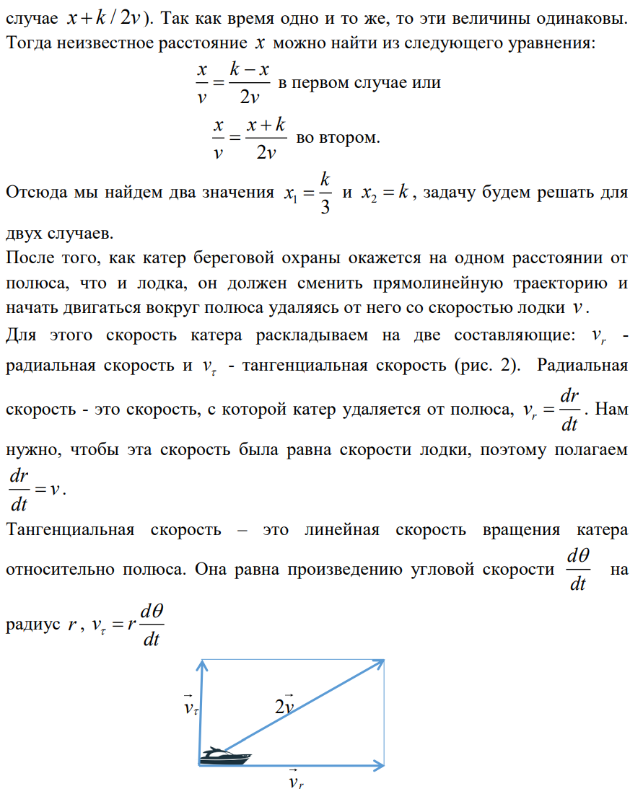
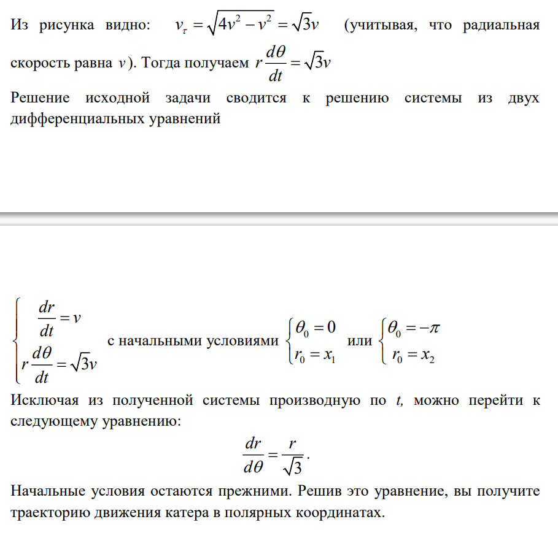
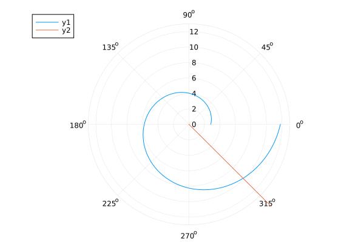
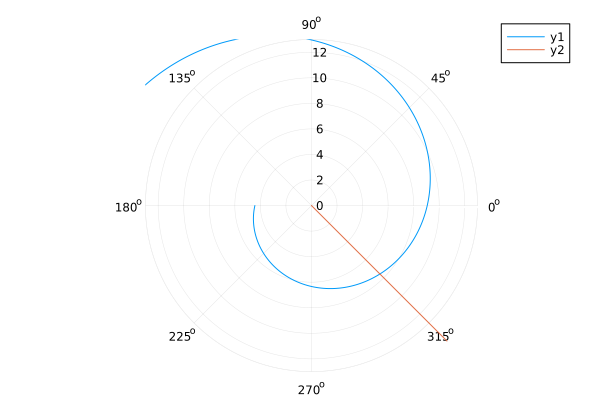

---
## Front matter
title: "Отчёт по лабораторной работе №2"
subtitle: "Задача о погоне, вариант 26"
author: "Маслова Анастасия Сергеевна"

## Generic otions
lang: ru-RU
toc-title: "Содержание"

## Bibliography
bibliography: bib/cite.bib
csl: pandoc/csl/gost-r-7-0-5-2008-numeric.csl

## Pdf output format
toc: true # Table of contents
toc-depth: 2
lof: true # List of figures
lot: true # List of tables
fontsize: 12pt
linestretch: 1.5
papersize: a4
documentclass: scrreprt
## I18n polyglossia
polyglossia-lang:
  name: russian
  options:
	- spelling=modern
	- babelshorthands=true
polyglossia-otherlangs:
  name: english
## I18n babel
babel-lang: russian
babel-otherlangs: english
## Fonts
mainfont: PT Serif
romanfont: PT Serif
sansfont: PT Sans
monofont: PT Mono
mainfontoptions: Ligatures=TeX
romanfontoptions: Ligatures=TeX
sansfontoptions: Ligatures=TeX,Scale=MatchLowercase
monofontoptions: Scale=MatchLowercase,Scale=0.9
## Biblatex
biblatex: true
biblio-style: "gost-numeric"
biblatexoptions:
  - parentracker=true
  - backend=biber
  - hyperref=auto
  - language=auto
  - autolang=other*
  - citestyle=gost-numeric
## Pandoc-crossref LaTeX customization
figureTitle: "Рис."
tableTitle: "Таблица"
listingTitle: "Листинг"
lofTitle: "Список иллюстраций"
lotTitle: "Список таблиц"
lolTitle: "Листинги"
## Misc options
indent: true
header-includes:
  - \usepackage{indentfirst}
  - \usepackage{float} # keep figures where there are in the text
  - \floatplacement{figure}{H} # keep figures where there are in the text
---

# Цель работы

Построение математических моделей для выбора правильной стратегии при решении задач поиска.

# Задание

На море в тумане катер береговой охраны преследует лодку браконьеров.
Через определенный промежуток времени туман рассеивается, и лодка
обнаруживается на расстоянии 15,5 км от катера. Затем лодка снова скрывается в
тумане и уходит прямолинейно в неизвестном направлении. Известно, что скорость
катера в 4,5 раза больше скорости браконьерской лодки.
1. Запишите уравнение, описывающее движение катера, с начальными
условиями для двух случаев (в зависимости от расположения катера
относительно лодки в начальный момент времени).
2. Постройте траекторию движения катера и лодки для двух случаев.
3. Найдите точку пересечения траектории катера и лодки 

# Теоретическое введение

{#fig:001 width=70%}

{#fig:002 width=70%}

{#fig:003 width=70%}

# Выполнение лабораторной работы

# Выполнение лабораторной работы

## Вывод уравнения

Запишем уравнение описывающее движение катера, с начальными условиями для двух случаев (в зависимости от расположения катера относительно лодки в 
начальный момент времени). Принимем за $t_0 = 0$, $x_0 = 0$ - место нахождения лодки браконьеров в момент обнаружения,($x_{k0} = k$) - место 
нахождения катера береговой охраны относительно лодки браконьеров в момент обнаружения лодки.

Введем полярные координаты. Считаем, что полюс - это точка обнаружения лодки браконьеров ($x_{k0}$) ($\theta = x_{k0} = 0$), а полярная ось $r$ 
проходит через точку нахождения катера береговой охраны. Траектория катера должна быть такой, чтобы и катер, и лодка все время были на одном расстоянии 
от полюса $\theta$ , только в этом случае траектория катера пересечется с траекторией лодки. Поэтому для начала катер береговой охраны должен двигаться 
некоторое время прямолинейно, пока не окажется на том же расстоянии от полюса, что и лодка браконьеров. После этого катер береговой охраны должен 
двигаться вокруг полюса удаляясь от него с той же скоростью, что и лодка браконьеров.

Чтобы найти расстояние $x$ (расстояние после которого катер начнет двигаться вокруг полюса), необходимо составить простое уравнение. 

Пусть через время $t$ катер и лодка окажутся на одном расстоянииx от полюса. За это время лодка пройдет $x$ , а катер $k-x$ (или $k+x$, в зависимости 
от начального положения катера относительно полюса). Время, за которое они пройдут это расстояние, вычисляется как $\dfrac{x}{v}$ или 
$\dfrac{k-x}{4.5v}$ (во втором случае $\dfrac{k+x}{4.5v}$). 

Так как время одно и то же, то эти величины одинаковы. Тогда расстояние можно найти из следующего уравнения:

$$
\dfrac{x}{v} = \dfrac{k-x}{4.5v} \text{ -- в 1 случае}
$$
$$
\dfrac{x}{v} = \dfrac{k+x}{4.5v} \text{ -- во 2 случае}
$$

Мы нашли два значения $x_1 = \dfrac{k}{5.5}$ и $x_2 = \dfrac{k}{3.5}$, для двух случаев.

После того, как катер береговой охраны окажется на одном расстоянии от полюса, что и лодка, он должен сменить прямолинейную траекторию и начать 
двигаться вокруг полюса удаляясь от него со скоростью лодки $v$. Для этого скорость катера раскладываем на две составляющие: $v_{r}$ - 
радиальная скорость и  - $v_{\tau}$ тангенциальная скорость. Радиальная скорость - это скорость, с которой катер удаляется от полюса, 
$v_r = \dfrac{dr}{dt}$. Нам нужно, чтобы эта скорость была равна скорости лодки, поэтому полагаем $\dfrac{dr}{dt} = v$.

Тангенциальная скорость – это линейная скорость вращения катера относительно полюса. Она равна произведению угловой скорости 
$\dfrac{d \theta}{dt}$ на радиус $r$, $r \dfrac{d \theta}{dt}$.

$$v_{\tau} = \sqrt{20.25v^2-v^2} = \sqrt{19.25}v$$

Так:

$$
r\dfrac{d \theta}{dt} = \sqrt{29.25}v
$$

Решение задачи сводится к решению системы:

$$\begin{cases}
&\dfrac{dr}{dt} = v\\
&r\dfrac{d \theta}{dt} = \sqrt{19.25}v
\end{cases}$$

С начальными условиями для первого случая:

$$\begin{cases}
&{\theta}_0 = 0\\  \tag{1}
&r_0 = x_1
\end{cases}$$

Или для второго:

$$\begin{cases}
&{\theta}_0 = -\pi\\  \tag{2}
&r_0 = x_2
\end{cases}$$

Исключая из полученной системы производную по $t$, можно перейти к следующему уравнению:

$$
\dfrac{dr}{d \theta} = \dfrac{r}{\sqrt{19.25}}
$$

Начальные условия остаются. Решив это уравнение, мы получим траекторию движения катера в полярных координатах.

## Поиск точки пересечения

Найдем точку пересечения траектории катера и лодки. Для этого нам нужно аналитическое решение дифф. ур., задающего траекторию движения катера.

Мы будем предпологать, что угол, под которым двигается лодка, будет $\dfrac{3 \pi}{4}$. Так как уравнение прямой задано через тангенс, а тангенс этого угла отрицательный, то для 1 случая подставим угол $\dfrac{7 \pi}{4}$, а для 2 - $- \dfrac{ \pi}{4}$


$$
r = \frac{15.5}{5.5} e^{\frac{1}{\sqrt{19.25}} \theta} \text{ -- для случая (1)}
$$

$$
r = \frac{77.5}{22.5} e^{(5 \pi \frac{\sqrt{299}}{299} + \frac{1}{\sqrt{19.25}}) \theta}  \text{ -- для случая (2)}
$$


В результате получим, что точки пересечения равны $( \dfrac{7 \pi}{4}, 9.866586187954175)$ - при условии (1) и $(-\dfrac{\pi}{4}, 45.920933646372056)$ при условии (2).

## Построение траектории

Ниже представлена реализация всего написанного выше на языке Julia.

```Julia
using OrdinaryDiffEq
using Plots
#вариант 26

s = 15.5 #начальное расстояние от лодки до катера
fi = 3*pi/4

#функция, описывающая движение катера береговой охраны
f(u,p,t) = u/sqrt(19.25)

#начальные условия в случае 1 и 2 соответственно

r0_1 = s/5.5
r0_2 = s/3.5

tetha1 = (0.0, 2*pi)
tetha2 = (-pi, pi)

#определение и решение задачи Коши в обоих случаях

r1 = ODEProblem(f, r0_1, tetha1)
r2 = ODEProblem(f, r0_2, tetha2)

sol1 = solve(r1, Tsit5(), saveat=0.01)
sol2 = solve(r2, Tsit5(), saveat=0.01)

#функция, описывающая движение лодки браконьеров
f2(t) = tan(fi)*t
t = 0:0.01:15

#движение катера

plot(sol1.t, sol1.u,
proj=:polar,
lims=(0,13)
)

#движение лодки

plot!(fill(fi,length(t)), f2.(t))

solution1(t) = (r0_1)*exp(1/sqrt(19.25)*t) 

solution2(t) = (r0_2*5)*exp(5*pi*sqrt(299)/299)*exp(1/sqrt(19.25)*t) 

intersection_r1 = solution1(7*pi/4)
intersection_r2 = solution2(-pi/4)

println(intersection_r1)
println(intersection_r2)

#точка пересечения для первого случая - 9.866586187954175
#точка пересечения для второго случая - 45.920933646372056

```

В результате у меня получились две траектории движения катера для двух случаев (рис. 1 и 2).

{#fig:004 width=70%}
{#fig:005 width=70%}

# Итог

В результате выполнения данной лабораторной работы я смогла построить математическую модель для выбора правильной стратегии в задаче о погоне.

# Список литературы{.unnumbered}

::: {#refs}
:::
