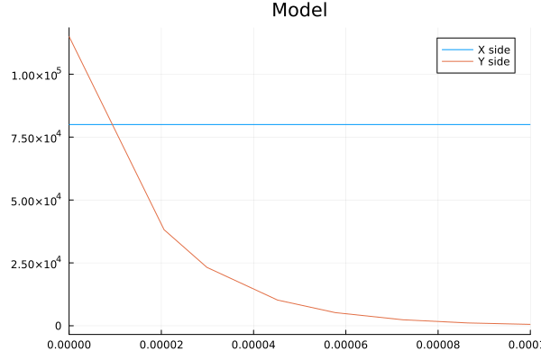
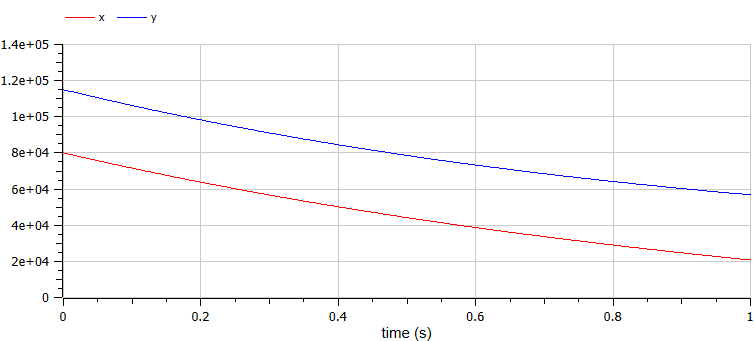
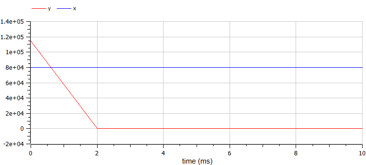

---
## Front matter
lang: ru-RU
title: Лабораторная работа №2
subtitle: Задача о погоне
author:
  - Маслова А. С.
institute:
  - Российский университет дружбы народов, Москва, Россия
date: 24 февраля 2024

## i18n babel
babel-lang: russian
babel-otherlangs: english

## Formatting pdf
toc: false
toc-title: Содержание
slide_level: 2
aspectratio: 169
section-titles: true
theme: metropolis
header-includes:
 - \metroset{progressbar=frametitle,sectionpage=progressbar,numbering=fraction}
 - '\makeatletter'
 - '\beamer@ignorenonframefalse'
 - '\makeatother'
---

# Информация

## Докладчик

:::::::::::::: {.columns align=center}
::: {.column width="70%"}

  * Маслова Анастасия Сергеевна
  * студентка группы НКНбд-01-21
  * Российский университет дружбы народов
  * <https://github.com/asmaslova>

:::
::: {.column width="30%"}


:::
::::::::::::::

# Вводная часть

## Цели 

Изучение и построение простейших моделей боевых действий, в частности - модели Ланчестера

## Задачи

Между страной Х и страной У идет война. Численность состава войск исчисляется от начала войны, и являются временными функциями
x(t) и y(t). В начальный момент времени страна Х имеет армию численностью 80 000 человек, а в распоряжении страны У армия 
численностью в 115 000 человек. Для упрощения модели считаем, что коэффициенты a, b, c, h постоянны. Также считаем P(t) и Q(t)
непрерывные функции.
Постройте графики изменения численности войск армии Х и армии У для следующих случаев:
1. Модель боевых действий между регулярными войсками
   
$\frac{d x}{dt} = -0.3x(t)-0.56y(t)+sin(t+10)$

$\frac{d y}{dt} = -0.68x(t)-0.3y(t)+cos(t+10)$

2. Модель ведение боевых действий с участием регулярных войск и
партизанских отрядов

$\frac{d x}{dt} = -0.31x(t)-0.77y(t)+sin(2t+10)$

$\frac{d y}{dt} = -0.67x(t)y(t)-0.51y(t)+cos(t+10)$

## Задачи

1. Запишите уравнение, описывающее движение катера, с начальными условиями для двух случаев (в зависимости от расположения катера относительно лодки в начальный момент времени).
2. Постройте траекторию движения катера и лодки для двух случаев.
3. Найдите точку пересечения траектории катера и лодки

## Материалы и методы

- Язык программирования `Julia`
  - Библиотеки
  	- `DifferentialEquations`
	  - `Plots`
- Язык программирования Modelica
- Среда для моделирования OpenModelica

# Выполнение лабораторной работы

## Необходимая теория

Модель боевых действий между регулярными войсками описывается следующим образом:

$\frac{d x}{dt} = -a(t)x(t)-b(t)y(t)+P(t)$

$\frac{d y}{dt} = -c(t)x(t)-h(t)y(t)+Q(t)$  (1)

Потери, не связанные с боевыми действиями, описывают члены a(t)x(t) и h(t)y(t), члены b(t)y(t) и c(t)x(t) отражают потери на поле боя.
Коэффициенты b(t) и c(t) указывают на эффективность боевых действий со стороны у и х соответственно, a(t), h(t) - величины, характеризующие степень
влияния различных факторов на потери. Функции P(t), Q(t) учитывают возможность подхода подкрепления к войскам Х и У в течение одного дня.

## Вывод уравнения

$\frac{d x}{dt} = -a(t)x(t)-b(t)y(t)+P(t)$

$\frac{d y}{dt} = -c(t)x(t)y(t)-h(t)y(t)+Q(t)$  (2)

В этой системе все величины имею тот же смысл, что и в системе (1).

## Моделирование

```Julia
using Plots
using DifferentialEquations

#начальные условия
x0 = 80000 #численность первой армии
y0 = 115000 #численность второй армии

a = 0.3 #константа, характеризующая степень влияния различных факторов на потери
b = 0.56 #эффективность боевых действий армии у
c = 0.68 #эффективность боевых действий армии х
h = 0.33 #константа, характеризующая степень влияния различных факторов на потери

function P(t)
    sin(t+10)
end

function Q(t)
    cos(t+10)
end

tspan=(0.0, 1)
```

## Построение траектории

```Julia
#Система дифференциальных уравнений
function syst!(du,y,p,t)
    du[1] = -a*y[1]-b*y[2]+P(t) #изменение численности первой армии
    du[2] = -c*y[1]-h*y[2]+Q(t) #изменение численности второй армии
end

v0 = [x0,y0] #Вектор начальных условий

#Решение системы
problem = ODEProblem(syst!, v0, tspan, 0)
y = solve(problem)

u1=Vector{Float64}()
u2=Vector{Float64}()

for i in range(1, length(y.t))
    push!(u1, y.u[i][1])
    push!(u2, y.u[i][2])
end    

plot(y.t, u1, label = "X side", title = "Model")
plot!(y.t, u2, label = "Y side", xlimit=[0, 1])
```

## Построение траектории

{#fig:004 width=70%}

## Построение траектории

{#fig:005 width=70%}

## Построение траектории

{#fig:004 width=70%}

## Построение траектории

{#fig:005 width=70%}

# Выводы

В результате выполнения данной лабораторной работы я познакомилась со средой OpenModelica, смогла построить математическую модель военных действий.

# Список литературы

- [https://esystem.rudn.ru/pluginfile.php/2289993/mod_resource/content/2/Лабораторная%20работа%20№%202.pdf]
- [https://ru.wikipedia.org/wiki/Законы_Осипова_—_Ланчестера]
