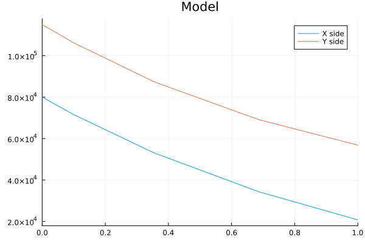
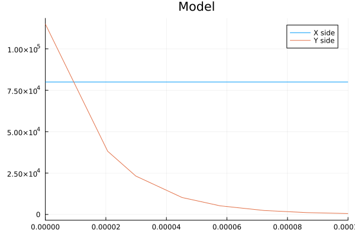
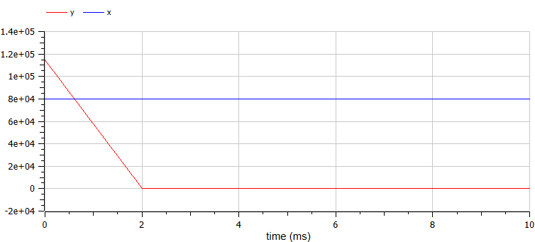

  ---
## Front matter
title: "Отчёт по лабораторной работе №3"
subtitle: "Модель боевых действий, вариант 26"
author: "Маслова Анастасия Сергеевна"

## Generic otions
lang: ru-RU
toc-title: "Содержание"

## Bibliography
bibliography: bib/cite.bib
csl: pandoc/csl/gost-r-7-0-5-2008-numeric.csl

## Pdf output format
toc: true # Table of contents
toc-depth: 2
lof: true # List of figures
lot: true # List of tables
fontsize: 12pt
linestretch: 1.5
papersize: a4
documentclass: scrreprt
## I18n polyglossia
polyglossia-lang:
  name: russian
  options:
	- spelling=modern
	- babelshorthands=true
polyglossia-otherlangs:
  name: english
## I18n babel
babel-lang: russian
babel-otherlangs: english
## Fonts
mainfont: PT Serif
romanfont: PT Serif
sansfont: PT Sans
monofont: PT Mono
mainfontoptions: Ligatures=TeX
romanfontoptions: Ligatures=TeX
sansfontoptions: Ligatures=TeX,Scale=MatchLowercase
monofontoptions: Scale=MatchLowercase,Scale=0.9
## Biblatex
biblatex: true
biblio-style: "gost-numeric"
biblatexoptions:
  - parentracker=true
  - backend=biber
  - hyperref=auto
  - language=auto
  - autolang=other*
  - citestyle=gost-numeric
## Pandoc-crossref LaTeX customization
figureTitle: "Рис."
tableTitle: "Таблица"
listingTitle: "Листинг"
lofTitle: "Список иллюстраций"
lotTitle: "Список таблиц"
lolTitle: "Листинги"
## Misc options
indent: true
header-includes:
  - \usepackage{indentfirst}
  - \usepackage{float} # keep figures where there are in the text
  - \floatplacement{figure}{H} # keep figures where there are in the text
---

# Цель работы

Изучение и построение простейших моделей боевых действий, в частности - модели Ланчестера

# Задание

Между страной Х и страной У идет война. Численность состава войск исчисляется от начала войны, и являются временными функциями
x(t) и y(t). В начальный момент времени страна Х имеет армию численностью 80 000 человек, а в распоряжении страны У армия 
численностью в 115 000 человек. Для упрощения модели считаем, что коэффициенты a, b, c, h постоянны. Также считаем P(t) и Q(t)
непрерывные функции.
Постройте графики изменения численности войск армии Х и армии У для следующих случаев:
1. Модель боевых действий между регулярными войсками
   
$\frac{d x}{dt} = -0.3x(t)-0.56y(t)+sin(t+10)$

$\frac{d y}{dt} = -0.68x(t)-0.3y(t)+cos(t+10)$

2. Модель ведение боевых действий с участием регулярных войск и
партизанских отрядов

$\frac{d x}{dt} = -0.31x(t)-0.77y(t)+sin(2t+10)$

$\frac{d y}{dt} = -0.67x(t)y(t)-0.51y(t)+cos(t+10)$


# Теоретическое введение

Рассмотрим некоторые простейшие модели боевых действий – модели Ланчестера. В противоборстве могут принимать участие как регулярные войска,
так и партизанские отряды. В общем случае главной характеристикой соперников являются численности сторон. Если в какой-то момент времени одна из
численностей обращается в нуль, то данная сторона считается проигравшей (при условии, что численность другой стороны в данный момент положительна).

Модель боевых действий между регулярными войсками описывается следующим образом:

$\frac{d x}{dt} = -a(t)x(t)-b(t)y(t)+P(t)$

$\frac{d y}{dt} = -c(t)x(t)-h(t)y(t)+Q(t)$  (1)

Потери, не связанные с боевыми действиями, описывают члены a(t)x(t) и h(t)y(t), члены b(t)y(t) и c(t)x(t) отражают потери на поле боя.
Коэффициенты b(t) и c(t) указывают на эффективность боевых действий со стороны у и х соответственно, a(t), h(t) - величины, характеризующие степень
влияния различных факторов на потери. Функции P(t), Q(t) учитывают возможность подхода подкрепления к войскам Х и У в течение одного дня.

Модель боевых действий между регулярными войсками и партизанскими отрядами описывается следующим образом:

$\frac{d x}{dt} = -a(t)x(t)-b(t)y(t)+P(t)$

$\frac{d y}{dt} = -c(t)x(t)y(t)-h(t)y(t)+Q(t)$  (2)

В этой системе все величины имею тот же смысл, что и в системе (1).

# Выполнение лабораторной работы

## Вывод уравнения

Для выполнения лабораторной реализуем пример кода в среде Scilab на языке программирования Julia. Ниже представлен код для первого случая - 
военных действий между регулярными войсками.
```Julia
using Plots
using DifferentialEquations

#начальные условия
x0 = 80000 #численность первой армии
y0 = 115000 #численность второй армии

a = 0.3 #константа, характеризующая степень влияния различных факторов на потери
b = 0.56 #эффективность боевых действий армии у
c = 0.68 #эффективность боевых действий армии х
h = 0.33 #константа, характеризующая степень влияния различных факторов на потери

function P(t)
    sin(t+10)
end

function Q(t)
    cos(t+10)
end

tspan=(0.0, 1)

#Система дифференциальных уравнений
function syst!(du,y,p,t)
    du[1] = -a*y[1]-b*y[2]+P(t) #изменение численности первой армии
    du[2] = -c*y[1]-h*y[2]+Q(t) #изменение численности второй армии
end

v0 = [x0,y0] #Вектор начальных условий

#Решение системы
problem = ODEProblem(syst!, v0, tspan, 0)
y = solve(problem)

u1=Vector{Float64}()
u2=Vector{Float64}()

for i in range(1, length(y.t))
    push!(u1, y.u[i][1])
    push!(u2, y.u[i][2])
end    

plot(y.t, u1, label = "X side", title = "Model")
plot!(y.t, u2, label = "Y side", xlimit=[0, 1])
```
Далее представлен код для случая военных действий между регулярными войсками и партизанскими отрядами.
```Julia
using Plots
using DifferentialEquations

#начальные условия
x0 = 80000 #численность первой армии
y0 = 115000 #численность второй армии

a = 0.31 #константа, характеризующая степень влияния различных факторов на потери
b = 0.77 #эффективность боевых действий армии у
c = 0.67 #эффективность боевых действий армии х
h = 0.51 #константа, характеризующая степень влияния различных факторов на потери

function P(t)
    sin(2t+10)
end

function Q(t)
    cos(t+10)
end

tspan=(0.0, 1)

#Система дифференциальных уравнений
function syst!(du,y,p,t)
    du[1] = -a*y[1]-b*y[2]+P(t) #изменение численности первой армии
    du[2] = -c*y[1]*y[2]-h*y[2]+Q(t) #изменение численности второй армии
end

v0 = [x0,y0] #Вектор начальных условий

#Решение системы
problem = ODEProblem(syst!, v0, tspan, 0)
y = solve(problem)

u1=Vector{Float64}()
u2=Vector{Float64}()

for i in range(1, length(y.t))
    push!(u1, y.u[i][1])
    push!(u2, y.u[i][2])
end    

plot(y.t, u1, label = "X side", title = "Model")
plot!(y.t, u2, label = "Y side", xlimit=[0, 0.0001])
```


В результате у меня получилось два графика уменьшения численности войск со временем (рис. 1 и 2).

{#fig:004 width=70%}
{#fig:005 width=70%}

Далее я построила ту же математическую модель, но в среде OpenModelica, и я получила две построенные модели (рис. 3 и 4).

{#fig:004 width=70%}
{#fig:005 width=70%}

# Итог

В результате выполнения данной лабораторной работы я познакомилась со средой OpenModelica, смогла построить математическую модель военных действий.

# Список литературы{.unnumbered}

::: {#refs}
:::
