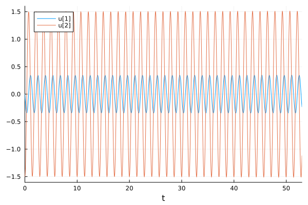
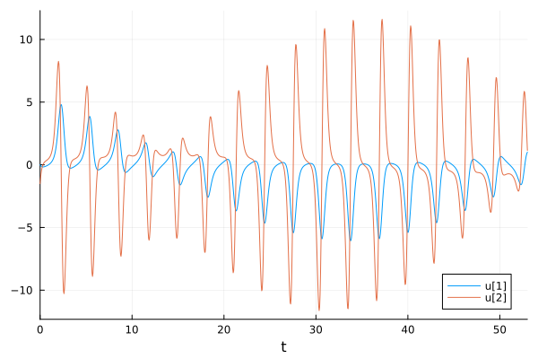
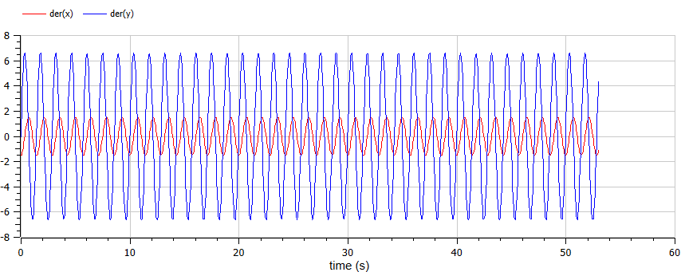
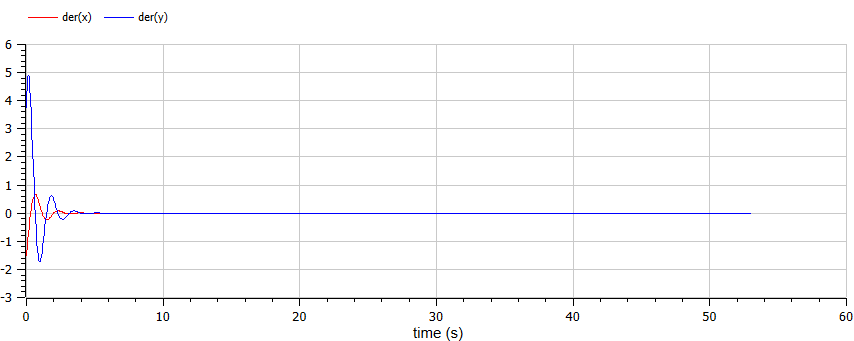
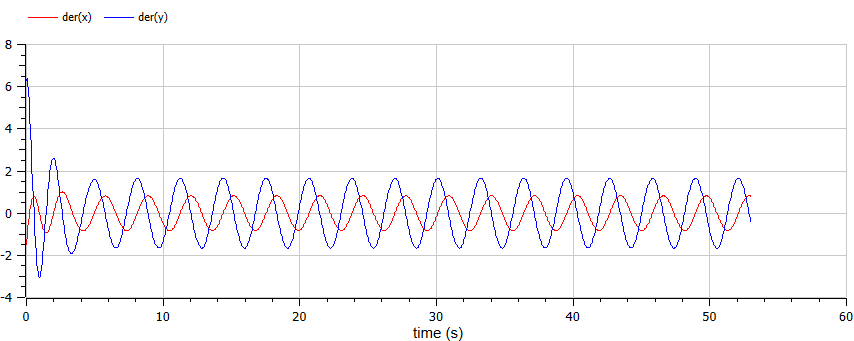

---
## Front matter
lang: ru-RU
title: Лабораторная работа №4
subtitle: Модель гармонических колебаний
author:
  - Маслова А. С.
institute:
  - Российский университет дружбы народов, Москва, Россия
date: 2 марта 2024

## i18n babel
babel-lang: russian
babel-otherlangs: english

## Formatting pdf
toc: false
toc-title: Содержание
slide_level: 2
aspectratio: 169
section-titles: true
theme: metropolis
header-includes:
 - \metroset{progressbar=frametitle,sectionpage=progressbar,numbering=fraction}
 - '\makeatletter'
 - '\beamer@ignorenonframefalse'
 - '\makeatother'
---

# Информация

## Докладчик

:::::::::::::: {.columns align=center}
::: {.column width="70%"}

  * Маслова Анастасия Сергеевна
  * студентка НКНбд-01-21
  * Российский университет дружбы народов
  * [1032216455@pfur.ru](mailto:1032216455@pfur.ru)
  * <https://github.com/asmaslova/>

:::
::: {.column width="30%"}


:::
::::::::::::::

# Вводная часть

## Теоретическая справка

Гармони́ческие колеба́ния — колебания, при которых физическая величина изменяется с течением времени по гармоническому (синусоидальному, косинусоидальному) закону.

## Теоретическая справка

Гармони́ческий осцилля́тор (в классической механике) — система, которая при выведении её из положения равновесия испытывает действие возвращающей силы F, пропорциональной смещению $x$:
$$
F = -kx,
$$
где $k$ — постоянный коэффициент.

## Задание

Постройте фазовый портрет гармонического осциллятора и решение уравнения гармонического осциллятора для следующих случаев

1. Колебания гармонического осциллятора без затуханий и без действий внешней силы $\ddot x + 4.4x = 0$
2. Колебания гармонического осциллятора c затуханием и без действий внешней силы $\ddot x + 2.5\dot x + 4x = 0$
3. Колебания гармонического осциллятора c затуханием и под действием внешней силы $\ddot x + 2\dot x + 3.3x = 3.3cos(2t)$

На интервале $t \in [0; 53]$ (шаг 0.05) с начальными условиями $x_0 = 0, \, y_0=-1.5$ 


# Выполнение работы

## Ход работы
```Julia
#Начальные условия и параметры

tspan = (0,62)

p1 = [0,10]
p2 = [1.5,3.0]
p3 = [0.6,1.0]

du0 = [-1.0]
u0 = [0.8]
```

## Ход работы
```Julia
#без действий внешней силы

function harm_osc(du,u,p,t)
	g,w = p
	du[1] = u[2]
	du[2] = -w^2 .* u[1] - g.*u[2]
end

#внешняя сила
f(t) = cos(1.5*t)
```

## Ход работы
```Julia
#с действием внешней силы
function forced_harm_osc(du,u,p,t)
	g,w = p
	du[1] = u[2]
	du[2] = -w^2 .* u[1] - g.*u[2] .+f(t)
end
```

## Ход работы

{#fig:001 width=70%}

## Ход работы

{#fig:002 width=70%}

## Ход работы

{#fig:003 width=70%}

## Ход работы

```Modelica
model lab4

Real x(start=0);
Real y(start=-1.5);

parameter Real w=4.4;
parameter Real g=0;

equation

der(x) = y;
der(y) = -w^2*x-g*y;

end lab4;
```

## Ход работы

{#fig:004 width=70%}

## Ход работы

```Modelica
model lab4

Real x(start=0);
Real y(start=-1.5);

parameter Real w=4;
parameter Real g=2.5;

equation

der(x) = y;
der(y) = -w^2*x-g*y;

end lab4;
```

## Ход работы

{#fig:005 width=70%}

## Ход работы

```Modelica
model lab4

Real x(start=0);
Real y(start=-1.5);

parameter Real w=3.3;
parameter Real g=2;
Real p;

equation

der(x) = y;
der(y) = -w^2*x-g*y+p;
p = 3.3*cos(2*time);

end lab4;
```

## Ход работы

{#fig:006 width=70%}

# Вывод
