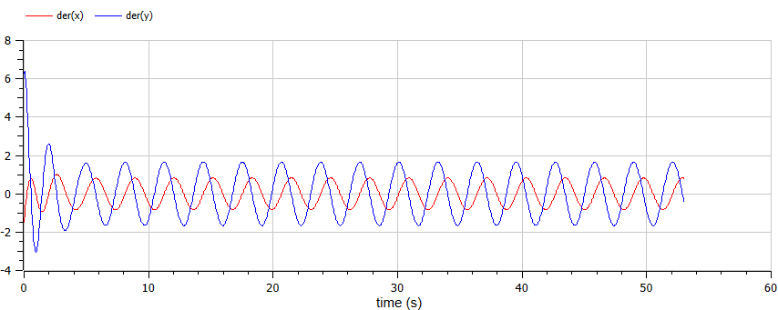

---
## Front matter
title: "Отчет к лабораторной работе №4"
subtitle: "Модель гармонических колебаний, вариант 26"
author: "Маслова Анастасия Сергеевна"

## Generic otions
lang: ru-RU
toc-title: "Содержание"

## Bibliography
bibliography: bib/cite.bib
csl: pandoc/csl/gost-r-7-0-5-2008-numeric.csl

## Pdf output format
toc: true # Table of contents
toc-depth: 2
lof: true # List of figures
lot: true # List of tables
fontsize: 12pt
linestretch: 1.5
papersize: a4
documentclass: scrreprt
## I18n polyglossia
polyglossia-lang:
  name: russian
  options:
	- spelling=modern
	- babelshorthands=true
polyglossia-otherlangs:
  name: english
## I18n babel
babel-lang: russian
babel-otherlangs: english
## Fonts
mainfont: PT Serif
romanfont: PT Serif
sansfont: PT Sans
monofont: PT Mono
mainfontoptions: Ligatures=TeX
romanfontoptions: Ligatures=TeX
sansfontoptions: Ligatures=TeX,Scale=MatchLowercase
monofontoptions: Scale=MatchLowercase,Scale=0.9
## Biblatex
biblatex: true
biblio-style: "gost-numeric"
biblatexoptions:
  - parentracker=true
  - backend=biber
  - hyperref=auto
  - language=auto
  - autolang=other*
  - citestyle=gost-numeric
## Pandoc-crossref LaTeX customization
figureTitle: "Рис."
tableTitle: "Таблица"
listingTitle: "Листинг"
lofTitle: "Список иллюстраций"
lotTitle: "Список таблиц"
lolTitle: "Листинги"
## Misc options
indent: true
header-includes:
  - \usepackage{indentfirst}
  - \usepackage{float} # keep figures where there are in the text
  - \floatplacement{figure}{H} # keep figures where there are in the text
---

# Цель работы

Построить модель гармонических колебаний с разными параматерами в различных условиях.

# Задание

Постройте фазовый портрет гармонического осциллятора и решение уравнения гармонического осциллятора для следующих случаев

1. Колебания гармонического осциллятора без затуханий и без действий внешней силы $\ddot x + 4.4x = 0$
2. Колебания гармонического осциллятора c затуханием и без действий внешней силы $\ddot x + 2.5\dot x + 4x = 0$
3. Колебания гармонического осциллятора c затуханием и под действием внешней силы $\ddot x + 2\dot x + 3.3x = 3.3cos(2t)$

На интервале $t \in [0; 53]$ (шаг 0.05) с начальными условиями $x_0 = 0, \, y_0=-1.5$ 


# Теоретическое введение

Гармони́ческие колеба́ния — колебания, при которых физическая величина изменяется с течением времени по гармоническому (синусоидальному, косинусоидальному) закону. [@wiki:motion:bash].

Гармони́ческий осцилля́тор (в классической механике) — система, которая при выведении её из положения равновесия испытывает действие возвращающей силы F, пропорциональной смещению $x$[@wiki:oscil:bash]:
$$
F = -kx,
$$

где $k$ — постоянный коэффициент.

Если $F$ — единственная сила, действующая на систему, то систему называют простым или консервативным гармоническим осциллятором. Свободные колебания такой системы представляют собой периодическое движение около положения равновесия (гармонические колебания). Частота и амплитуда при этом постоянны, причём частота не зависит от амплитуды.

Если имеется ещё и сила трения (затухание), пропорциональная скорости движения (вязкое трение), то такую систему называют затухающим или диссипативным осциллятором. Если трение не слишком велико, то система совершает почти периодическое движение — синусоидальные колебания с постоянной частотой и экспоненциально убывающей амплитудой. Частота свободных колебаний затухающего осциллятора оказывается несколько ниже, чем у аналогичного осциллятора без трения. 

Уравнение свободных колебаний гармонического осциллятора имеет следующий вид:

$$
\ddot x + 2\gamma\dot x + \omega _0^2x = 0, \tag{1}
$$

где $x$ – переменная, описывающая состояние системы (смещение грузика, заряд конденсатора и т.д.), $\gamma$ -- параметр, характеризующий потери энергии (трение в механической системе, сопротивление в контуре), $\omega _0$ – собственная частота колебаний, $t$ – время. (Обозначения $\ddot x = \dfrac{\partial^2x}{\partial t^2}$, $\dot x = \dfrac{\partial x}{\partial t}$) 

Уравнение (1) есть линейное однородное дифференциальное уравнение второго порядка и оно является примером линейной динамической системы.
При отсутствии потерь в системе ($\gamma = 0$) вместо уравнения (1) получаем уравнение консервативного осциллятора энергия колебания которого сохраняется во времени:

$$
\ddot x + \omega _0 ^2 = 0. \tag{2}
$$

Для однозначной разрешимости уравнения второго порядка (2) необходимо задать два начальных условия вида

$$
\begin{cases}
 x(t_0) = x_0, \\ \tag{3}
 \dot x(t_0) = y_0.
\end{cases}
$$

где $x(y)$ – численности войск первой (второй) стороны в момент времени $t$; $a_x$ ($a_y$) – эффективность огня первой (второй) стороны (число поражаемых целей противника в единицу времени)1; p и q – параметры степени.
В начальный момент времени заданы численности сторон: $x(0) = x_0$ и $y(0) = y_0$.

Уравнение второго порядка (2) можно представить в виде системы двух уравнений первого порядка:

$$
\begin{cases}
  \dot x = y, \\ \tag{4}
  \dot y = -\omega _0 ^2 x
\end{cases}
$$

Начальные условия (3) для системы (4) примут вид:

$$
\begin{cases}
 x(t_0) = x_0, \\ \tag{5}
 y(t_0) = y_0.
\end{cases}
$$

Независимые переменные $x$, $y$ определяют пространство, в котором «движется» решение. Это фазовое пространство системы, поскольку оно двумерно будем называть его фазовой плоскостью.

Значение фазовых координат $x$, $y$ в любой момент времени полностью определяет состояние системы. Решению уравнения движения как функции времени отвечает гладкая кривая в фазовой плоскости. Она называется фазовой траекторией. Если множество различных решений (соответствующих различным начальным условиям) изобразить на одной фазовой плоскости, возникает общая картина поведения системы. Такую картину, образованную набором фазовых траекторий, называют фазовым портретом

# Выполнение лабораторной работы

## Реализация в Julia

Для начала реализуем описанную выше теорию в языке программирования Julia:
```Julia
#вариант 26
using Plots
using DifferentialEquations

tspan = (0,53)

p1 = [0, 4.4]
p2 = [2.5, 4]
p3 = [2, 3.3]

du0 = [-1.5]
u0 = [0]

function harmonic_osc(du, u, p, t)
	g,w = p
	du[1] = u[2]
	du[2] = -w^2 .* u[1] - g.*u[2]
end

f(t) = 3.3*cos(2*t)

function forced_harmonic_osc(du, u, p, t)
	g,w = p
	du[1] = u[2]
	du[2] = -w^2 .* u[1] - g.*u[2].*f(t)
end

prob1 = ODEProblem(harmonic_osc, [0, -1.5], tspan, p1)
sol1 = solve(prob1, Tsit5(), saveat=0.05)

prob2 = ODEProblem(harmonic_osc, [0, -1.5], tspan, p2)
sol2 = solve(prob2, Tsit5(), saveat=0.05)

prob3 = ODEProblem(forced_harmonic_osc, [0, -1.5], tspan, p3)
sol3 = solve(prob3, Tsit5(), saveat=0.05)

```
В результате у меня получились три фазовых портрета для трех случае: без затуханий и без действий внешней силы (рис. @fig:001), с затуханием и без действий внешней силы (рис. @fig:002), с затуханием и под действием внешней силы (рис. @fig:003).

{#fig:001 width=70%}

{#fig:002 width=70%}

{#fig:003 width=70%}

## Реализация в OpenModelica

Ту же самую задачу пробуем решить на языке Modelica. Для колебаний без затуханий и без действий внешней силы использовала данную модель:

```Modelica
model lab4

Real x(start=0);
Real y(start=-1.5);

parameter Real w=4.4;
parameter Real g=0;

equation

der(x) = y;
der(y) = -w^2*x-g*y;

end lab4;
```

В результате получила фазовый портрет (рис. @fig:004).

{#fig:004 width=70%}

Для колебаний с затуханием и без действий внешней силы использовала данную модель:

```Modelica
model lab4

Real x(start=0);
Real y(start=-1.5);

parameter Real w=4;
parameter Real g=2.5;

equation

der(x) = y;
der(y) = -w^2*x-g*y;

end lab4;
```

В результате получила фазовый портрет (рис. @fig:005).

{#fig:005 width=70%}

Для колебаний с затуханием и с действием внешней силы использовала данную модель:

```Modelica
model lab4

Real x(start=0);
Real y(start=-1.5);

parameter Real w=3.3;
parameter Real g=2;
Real p;

equation

der(x) = y;
der(y) = -w^2*x-g*y+p;
p = 3.3*cos(2*time);

end lab4;
```

В результате получила фазовый портрет (рис. @fig:006).

{#fig:006 width=70%}

# Выводы

В обеих реализациях итоговый фазовый портрет получился практически идентичным, что означает точность обоих методов.

# Список литературы{.unnumbered}

::: {#refs}
:::
