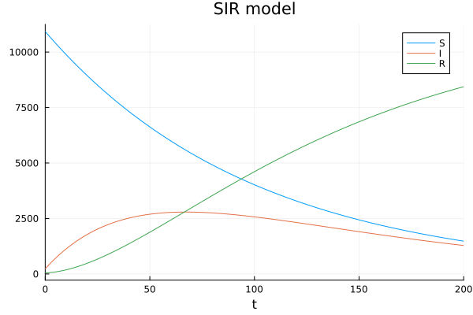
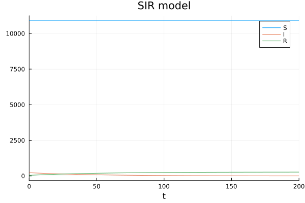
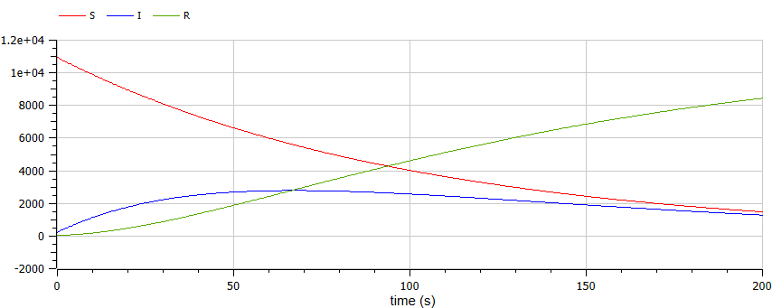
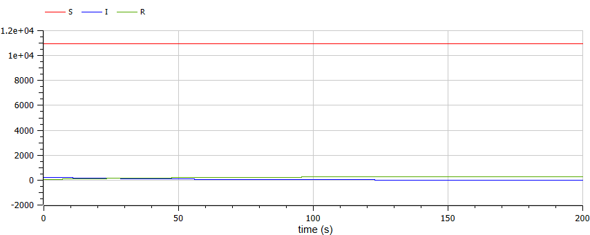

---
## Front matter
lang: ru-RU
title: Лабораторная работа №6
subtitle: Задача об эпидемии
author:
  - Маслова А. С.
institute:
  - Российский университет дружбы народов, Москва, Россия
date: 15 марта 2024

## i18n babel
babel-lang: russian
babel-otherlangs: english

## Formatting pdf
toc: false
toc-title: Содержание
slide_level: 2
aspectratio: 169
section-titles: true
theme: metropolis
header-includes:
 - \metroset{progressbar=frametitle,sectionpage=progressbar,numbering=fraction}
 - '\makeatletter'
 - '\beamer@ignorenonframefalse'
 - '\makeatother'
---

# Информация

## Докладчик

:::::::::::::: {.columns align=center}
::: {.column width="70%"}

  * Маслова Анастасия Сергеевна
  * студентка НКНбд-01-21
  * Российский университет дружбы народов
  * [1032216455@rudn.ru](mailto:1032216455@rudn.ru)
  * <https://github.com/asmaslova>

:::
::: {.column width="30%"}


:::
::::::::::::::

# Вводная часть

## Задание

На одном острове вспыхнула эпидемия. Известно, что из всех проживающих на острове (N=11 200) в момент начала эпидемии (t=0) число заболевших людей (являющихся распространителями инфекции) I(0)=230, А число здоровых людей с иммунитетом к болезни R(0)=45. Таким образом, число людей восприимчивых к болезни, но пока здоровых, в начальный момент времени S(0)=N-I(0)- R(0).
Постройте графики изменения числа особей в каждой из трех групп. Рассмотрите, как будет протекать эпидемия в случае:
1) если $I(0) \leq I*$
2) если $I(0) > I*$

# Выполнение работы

## Начальные параметры

```Julia
N = 11200 # общая численность популяции
tspan = (0.0,200.0)
I = 230 # количество инфицированных особей в начальный момент времени
R = 45 #  количество здоровых особей с иммунитетом в начальный момент времени
S = N - I - R # количество восприимчивых к болезни, но пока здоровых особей в начальный момент времени
u0 = [S, I, R]
p = [0.01, 0.02] # коэффициенты заболеваемости и выздоровления соответственно
```

## Функция для вычисления в случае, если $I(0) > I*$

```Julia
function sir!(du,u,p,t) # при I(0)>I*
    a,b = p
	S, I, R = u
    du[1] = -a*u[1] #dS
    du[2] = a*u[1] - b*u[2] #dI
    du[3] = b*u[2] #dR
end
```

## Функция для вычисления в случае, если $I(0) \leq I*$

```Julia
function sir1!(du,u,p,t) # при I(0)<I*
    a,b = p
    du[1] = 0
    du[2] = - b*u[2]
    du[3] = b*u[2]
end
```

## Модель в случае, если $I(0) > I*$

{#fig:001 width=70%}

## Модель в случае, если $I(0) \leq I*$

{#fig:002 width=70%}

## Реализация в OpenModelica в первом случае

```Modelica
model lab6
parameter Real N = 11200;
parameter Real a = 0.01;
parameter Real b = 0.02;
Real I(start=230);
Real R(start=45);
Real S(start=11200-230-45);
equation
der(S) = -a*S;
der(I) = a*S - b*I;
der(R) = b*I;
end lab6;
```

## Реализация в OpenModelica во втором случае

```Modelica
model lab6
parameter Real N = 11200;
parameter Real a = 0.01;
parameter Real b = 0.02;
Real I(start=230);
Real R(start=45);
Real S(start=11200-230-45);
equation
der(S) = 0;
der(I) = -b*I;
der(R) = b*I;
end lab6;
```

## Модель в случае, если $I(0) > I*$

{#fig:003 width=70%}

## Модель в случае, если $I(0) \leq I*$

{#fig:004 width=70%}

# Вывод

## Вывод

В ходе лабораторной работы я познакомилась с моделью эпидемии SIR и смогла реализовать ее с помощью Julia и OpenModelica.