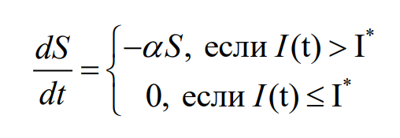
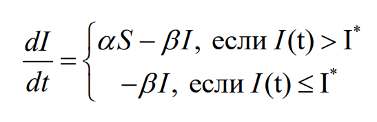
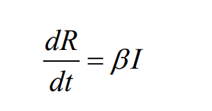
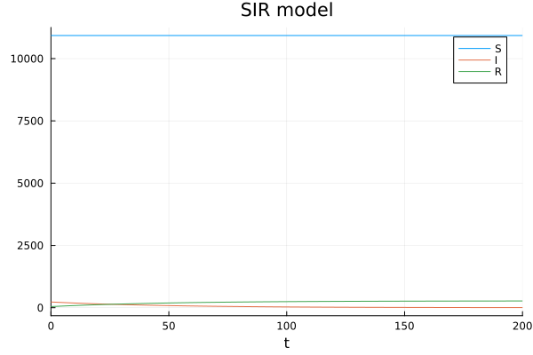
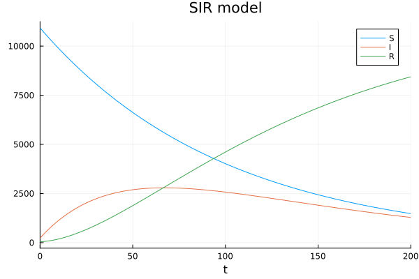
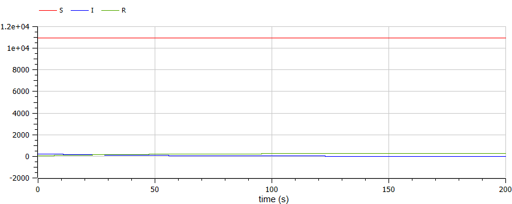
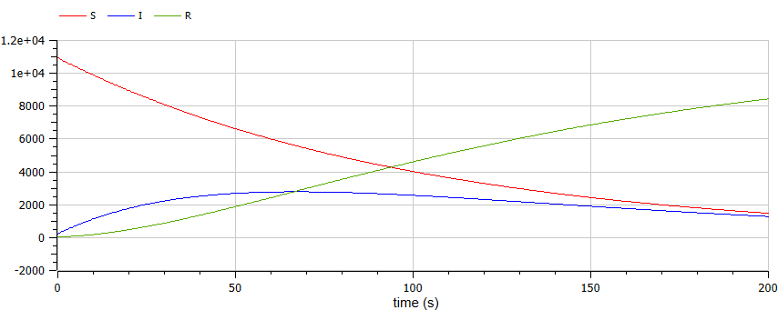

---
## Front matter
title: "Отчет по лабораторной работе №6"
subtitle: "Задача об эпидемии"
author: "Маслова Анастасия Сергеевна"

## Generic otions
lang: ru-RU
toc-title: "Содержание"

## Bibliography
bibliography: bib/cite.bib
csl: pandoc/csl/gost-r-7-0-5-2008-numeric.csl

## Pdf output format
toc: true # Table of contents
toc-depth: 2
lof: true # List of figures
lot: true # List of tables
fontsize: 12pt
linestretch: 1.5
papersize: a4
documentclass: scrreprt
## I18n polyglossia
polyglossia-lang:
  name: russian
  options:
	- spelling=modern
	- babelshorthands=true
polyglossia-otherlangs:
  name: english
## I18n babel
babel-lang: russian
babel-otherlangs: english
## Fonts
mainfont: PT Serif
romanfont: PT Serif
sansfont: PT Sans
monofont: PT Mono
mainfontoptions: Ligatures=TeX
romanfontoptions: Ligatures=TeX
sansfontoptions: Ligatures=TeX,Scale=MatchLowercase
monofontoptions: Scale=MatchLowercase,Scale=0.9
## Biblatex
biblatex: true
biblio-style: "gost-numeric"
biblatexoptions:
  - parentracker=true
  - backend=biber
  - hyperref=auto
  - language=auto
  - autolang=other*
  - citestyle=gost-numeric
## Pandoc-crossref LaTeX customization
figureTitle: "Рис."
tableTitle: "Таблица"
listingTitle: "Листинг"
lofTitle: "Список иллюстраций"
lotTitle: "Список таблиц"
lolTitle: "Листинги"
## Misc options
indent: true
header-includes:
  - \usepackage{indentfirst}
  - \usepackage{float} # keep figures where there are in the text
  - \floatplacement{figure}{H} # keep figures where there are in the text
---

# Цель работы

Рассмотреть и построить простейшую модель эпидемии SIR.

# Задание

На одном острове вспыхнула эпидемия. Известно, что из всех проживающих на острове (N=11 200) в момент начала эпидемии (t=0) число заболевших людей (являющихся распространителями инфекции) I(0)=230, А число здоровых людей с иммунитетом к болезни R(0)=45. Таким образом, число людей восприимчивых к болезни, но пока здоровых, в начальный момент времени S(0)=N-I(0)- R(0).

Постройте графики изменения числа особей в каждой из трех групп.
Рассмотрите, как будет протекать эпидемия в случае:
1) если $I(0) \leq I*$
2) если $I(0) > I*$

# Теоретическое введение

Предположим, что некая популяция, состоящая из N особей, (считаем, что популяция изолирована) подразделяется на три группы. Первая группа - это восприимчивые к болезни, но пока здоровые особи, обозначим их через S(t). Вторая группа – это число инфицированных особей, которые также при этом являются распространителями инфекции, обозначим их I(t). А третья группа, обозначающаяся через R(t) – это здоровые особи с иммунитетом к болезни (@lab:bash).

До того, как число заболевших не превышает критического значения I*, считаем, что все больные изолированы и не заражают здоровых. Когда I(t) > I*, тогда инфицирование способны заражать восприимчивых к болезни особей.
Таким образом, скорость изменения числа S(t) меняется по следующему закону (рис. @fig:001)

{#fig:001 width=70%}

Поскольку каждая восприимчивая к болезни особь, которая, в конце концов, заболевает, сама становится инфекционной, то скорость изменения числа инфекционных особей представляет разность за единицу времени между заразившимися и теми, кто уже болеет и лечится, т.е. см рис. @fig:002

{#fig:002 width=70%}

А скорость изменения выздоравливающих особей (при этом приобретающие иммунитет к болезни) изменяется по закону на рис. @fig:003.

{#fig:003 width=70%}

Постоянные пропорциональности $\alpha$,$\beta$, - это коэффициенты заболеваемости и выздоровления соответственно.

Для того, чтобы решения соответствующих уравнений определялось однозначно, необходимо задать начальные условия. Считаем, что на начало эпидемии в момент времени $t = 0$ нет особей с иммунитетом к болезни R(0)=0, а число инфицированных и восприимчивых к болезни особей I(0) и S(0) соответственно. Для анализа картины протекания эпидемии необходимо
рассмотреть два случая:
1) если $I(0) \leq I*$
2) если $I(0) > I*$

# Выполнение лабораторной работы

Реализация на языке программирования Julia выглядит у меня следующим образом:

```Julia
#вариант 26

using Plots
using DifferentialEquations

N = 11200 # общая численность популяции
tspan = (0.0,200.0)
I = 230 # количество инфицированных особей в начальный момент времени
R = 45 #  количество здоровых особей с иммунитетом в начальный момент времени
S = N - I - R # количество восприимчивых к болезни, но пока здоровых особей в начальный момент времени
u0 = [S, I, R]
p = [0.01, 0.02] # коэффициенты заболеваемости и выздоровления соответственно

function sir!(du,u,p,t) # при I(0)>I*
    a,b = p
	S, I, R = u
    du[1] = -a*u[1] #dS
    du[2] = a*u[1] - b*u[2] #dI
    du[3] = b*u[2] #dR
end

function sir1!(du,u,p,t) # при I(0)<I*
    a,b = p
    du[1] = 0
    du[2] = - b*u[2]
    du[3] = b*u[2]
end

prob1 = ODEProblem(sir!,u0,tspan,p)
sol1 = solve(prob1, Tsit5())

prob2 = ODEProblem(sir1!,u0,tspan,p)
sol2 = solve(prob2, Tsit5())

plot(sol2, title="SIR model", label = ["S" "I" "R"])
#savefig("C:\\Users\\anast\\work\\study\\2023-2024\\Математическое моделирование\\mathmod\\labs\\lab6\\report\\image\\lessthanjulia.png")
```

В результате я получила два графика: в случае, когда $I(0) \leq I*$ (рис. @fig:004), и в случае, когда если $I(0) > I*$ (рис. @fig:005).

{#fig:004 width=70%}

{#fig:005 width=70%}


Ту же модель я реализовала в среде OpenModelica. Код для первого случая ($I(0) \leq I*$) представлен ниже:

```Modelica
model lab6

parameter Real N = 11200;
parameter Real a = 0.01;
parameter Real b = 0.02;
Real I(start=230);
Real R(start=45);
Real S(start=11200-230-45);

equation

der(S) = 0;
der(I) = -b*I;
der(R) = b*I;

end lab6;
```

В результате я получила такой график (рис. @fig:006):

{#fig:006 width=70%}

Ниже представлен код для второго случая ($I(0) > I*$):

```Modelica
model lab6

parameter Real N = 11200;
parameter Real a = 0.01;
parameter Real b = 0.02;
Real I(start=230);
Real R(start=45);
Real S(start=11200-230-45);

equation

der(S) = -a*S;
der(I) = a*S - b*I;
der(R) = b*I;

end lab6;
```

В результате я получила вот такой график (рис. @fig:007):

{#fig:007 width=70%}

Можно заметить, что графики, построенные с помощью языка Julia и с помощью OpenModelica идентичны.

# Выводы

В ходе лабораторной работы я познакомилась с простейшей моделью эпидемии SIR и построила ее, используя Julia и OpenModelica.

# Список литературы{.unnumbered}

::: {#refs}
:::

