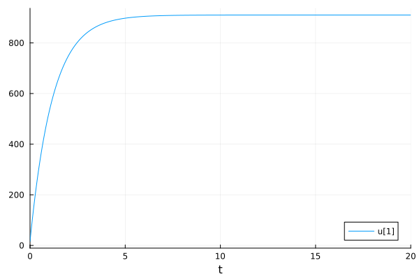
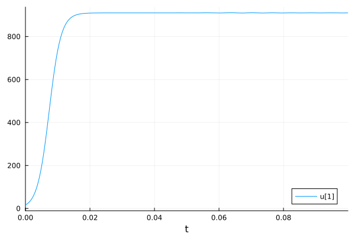
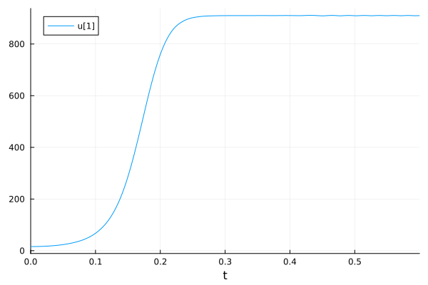
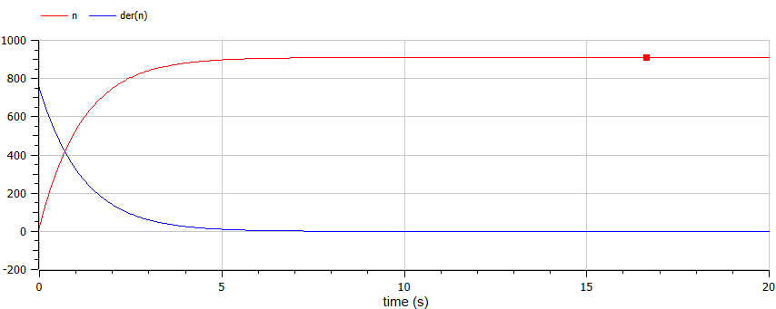
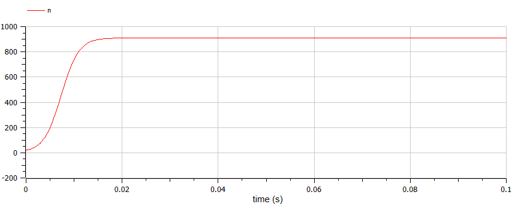
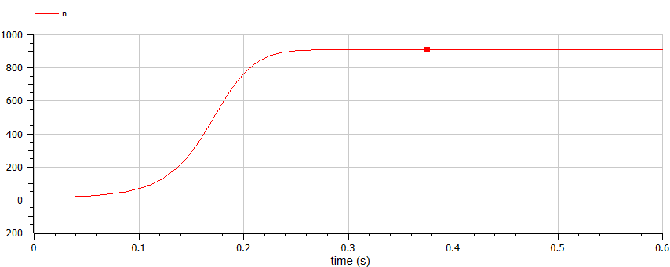

---
## Front matter
lang: ru-RU
title: Лабораторная работа №7
subtitle: "Эффективность рекламы. Вариант 26"
author: 
  - Маслова А. С.
institute:
  - Российский университет дружбы народов, Москва, Россия
  - Объединённый институт ядерных исследований, Дубна, Россия
date: 23 марта 2024

## i18n babel
babel-lang: russian
babel-otherlangs: english

## Formatting pdf
toc: false
toc-title: Содержание
slide_level: 2
aspectratio: 169
section-titles: true
theme: metropolis
header-includes:
 - \metroset{progressbar=frametitle,sectionpage=progressbar,numbering=fraction}
 - '\makeatletter'
 - '\beamer@ignorenonframefalse'
 - '\makeatother'
---

# Информация

## Докладчик

:::::::::::::: {.columns align=center}
::: {.column width="70%"}

  * Маслова Анастасия Сергеевна
  * студентка НКНбд-01-21
  * Российский университет дружбы народов
  * [1032216455@rudn.ru](mailto:1032216455@rudn.ru)
  * <https://github.com/asmaslova>

:::
::: {.column width="30%"}

:::
::::::::::::::

# Вводная часть

## Задание

Постройте график распространения рекламы, математическая модель которой описывается
следующим уравнением:
1. $\frac{dn}{dt} = (0.84 + 0.00002n(t))(N - n(t))$
2. $\frac{dn}{dt} = (0.000084 + 0.6n(t))(N - n(t))$
2. $\frac{dn}{dt} = (0.3 \sin (3t) + 0.3 \cdot t \cdot n(t))(N - n(t))$

При этом объем аудитории $N = 910$, в начальный момент о товаре знает 16 человек. Для случая 2 определите в какой момент времени скорость распространения рекламы будет иметь максимальное значение.

## Теоретическое введение

Модель рекламной кампании описывается следующими величинами. Считаем, что $\frac{dn}{dt}$ - скорость изменения со временем числа потребителей, узнавших о товаре и готовых его купить, $t$ - время, прошедшее с начала рекламной кампании, $n(t)$ - число уже информированных клиентов. Эта величина пропорциональна числу покупателей, еще не знающих о нем, это описывается следующим образом: $\alpha _1(t)(N-n(t)$ , где $N$ - общее число потенциальных платежеспособных покупателей, $\alpha _1(t)>0$ - характеризует интенсивность рекламной кампании (зависит от затрат на рекламу в данный момент времени).

## Теоретическое введение

Помимо этого, узнавшие о товаре потребители также распространяют полученную информацию среди потенциальных покупателей, не знающих о нем (в этом случае работает т.н. сарафанное радио). Этот вклад в рекламу описывается величиной $\alpha _2(t)n(t)(N - n(t))$, эта величина увеличивается с увеличением потребителей, узнавших о товаре. Математическая модель распространения рекламы описывается уравнением:

$\frac{dn}{dt} = (\alpha _1(t) + \alpha _2(t)n(t))(N - n(t))$ (1)

# Выполнение работы

## Реализация на Julia

{#fig:001 width=70%}

## Реализация на Julia

{#fig:002 width=70%}

## Реализация на Julia

{#fig:003 width=70%}

## Реализация в OpenModelica

{#fig:004 width=70%}

## Реализация в OpenModelica

{#fig:005 width=70%}

## Реализация в OpenModelica

{#fig:006 width=70%}

# Вывод

## Вывод

В ходе работы я познакомилась с моделью рекламной кампании и смогла реализовать ее на практике.