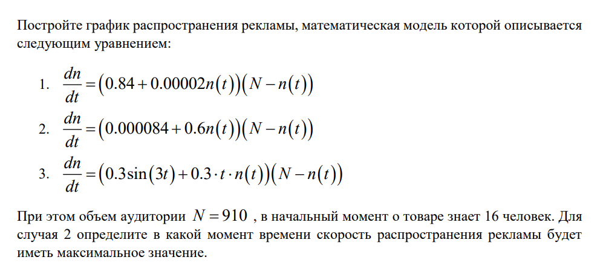
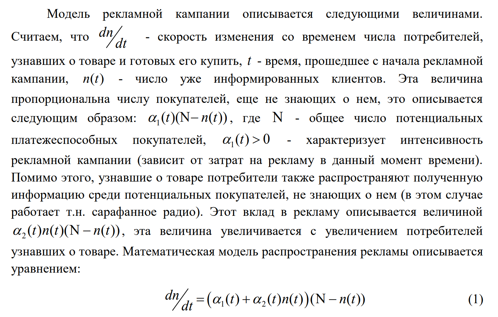

---
## Front matter
lang: ru-RU
title: Лабораторная работа №7
subtitle: "Эффективность рекламы. Вариант 26"
author: 
  - Маслова А. С.
institute:
  - Российский университет дружбы народов, Москва, Россия
date: 23 марта 2024

## i18n babel
babel-lang: russian
babel-otherlangs: english

## Formatting pdf
toc: false
toc-title: Содержание
slide_level: 2
aspectratio: 169
section-titles: true
theme: metropolis
header-includes:
 - \metroset{progressbar=frametitle,sectionpage=progressbar,numbering=fraction}
 - '\makeatletter'
 - '\beamer@ignorenonframefalse'
 - '\makeatother'
---

# Информация

## Докладчик

:::::::::::::: {.columns align=center}
::: {.column width="70%"}

  * Маслова Анастасия Сергеевна
  * студентка НКНбд-01-21
  * Российский университет дружбы народов
  * [1032216455@rudn.ru](mailto:1032216455@rudn.ru)
  * <https://github.com/asmaslova>

:::
::: {.column width="30%"}

:::
::::::::::::::

# Вводная часть

## Задание

{#fig:007 width=70%}

## Теоретическое введение

{#fig:008 width=70%}

# Выполнение работы

## Реализация на Julia

{#fig:001 width=70%}

## Реализация на Julia

{#fig:002 width=70%}

## Реализация на Julia

{#fig:003 width=70%}

## Реализация в OpenModelica

{#fig:004 width=70%}

## Реализация в OpenModelica

{#fig:005 width=70%}

## Реализация в OpenModelica

{#fig:006 width=70%}

# Вывод

## Вывод

В ходе работы я познакомилась с моделью рекламной кампании и смогла реализовать ее на практике.