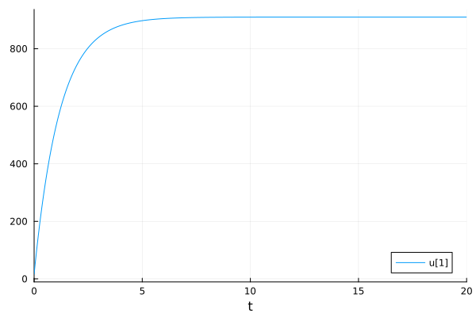
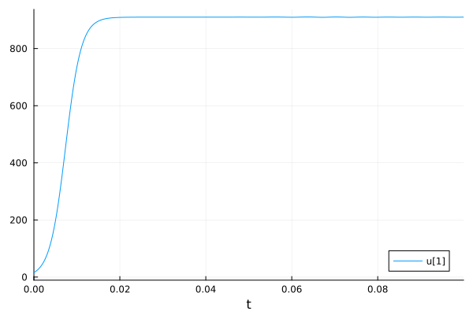
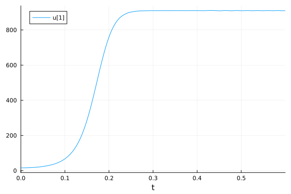
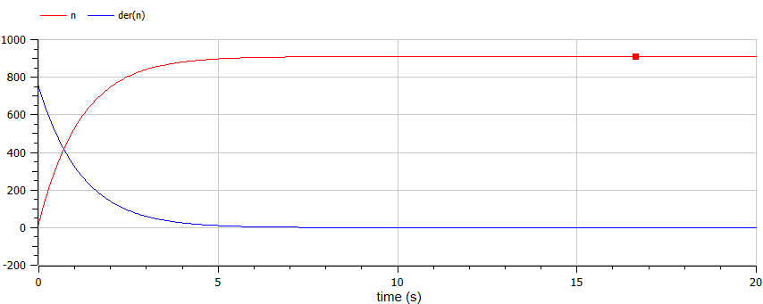
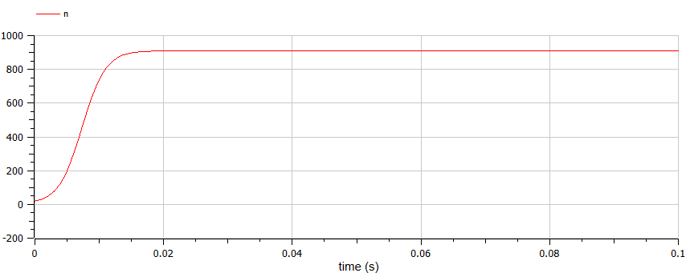
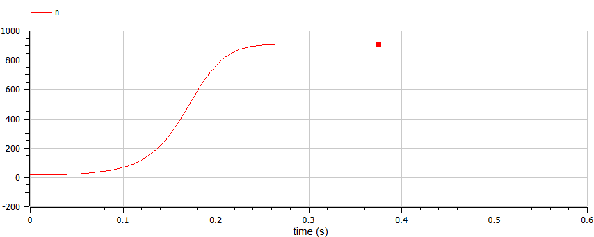

---
## Front matter
title: "Отчет по лабораторной работе"
subtitle: "Эффективность рекламы. Вариант 26"
author: "Маслова Анастасия Сергеевна"

## Generic otions
lang: ru-RU
toc-title: "Содержание"

## Bibliography
bibliography: bib/cite.bib
csl: pandoc/csl/gost-r-7-0-5-2008-numeric.csl

## Pdf output format
toc: true # Table of contents
toc-depth: 2
lof: true # List of figures
lot: true # List of tables
fontsize: 12pt
linestretch: 1.5
papersize: a4
documentclass: scrreprt
## I18n polyglossia
polyglossia-lang:
  name: russian
  options:
	- spelling=modern
	- babelshorthands=true
polyglossia-otherlangs:
  name: english
## I18n babel
babel-lang: russian
babel-otherlangs: english
## Fonts
mainfont: PT Serif
romanfont: PT Serif
sansfont: PT Sans
monofont: PT Mono
mainfontoptions: Ligatures=TeX
romanfontoptions: Ligatures=TeX
sansfontoptions: Ligatures=TeX,Scale=MatchLowercase
monofontoptions: Scale=MatchLowercase,Scale=0.9
## Biblatex
biblatex: true
biblio-style: "gost-numeric"
biblatexoptions:
  - parentracker=true
  - backend=biber
  - hyperref=auto
  - language=auto
  - autolang=other*
  - citestyle=gost-numeric
## Pandoc-crossref LaTeX customization
figureTitle: "Рис."
tableTitle: "Таблица"
listingTitle: "Листинг"
lofTitle: "Список иллюстраций"
lotTitle: "Список таблиц"
lolTitle: "Листинги"
## Misc options
indent: true
header-includes:
  - \usepackage{indentfirst}
  - \usepackage{float} # keep figures where there are in the text
  - \floatplacement{figure}{H} # keep figures where there are in the text
---

# Цель работы

Познакомиться с моделью рекламной кампании и реализовать ее на практике.

# Задание

Постройте график распространения рекламы, математическая модель которой описывается
следующим уравнением:
1. $\frac{dn}{dt} = (0.84 + 0.00002n(t))(N - n(t))$
2. $\frac{dn}{dt} = (0.000084 + 0.6n(t))(N - n(t))$
2. $\frac{dn}{dt} = (0.3 \sin (3t) + 0.3 \cdot t \cdot n(t))(N - n(t))$
При этом объем аудитории $N = 910$, в начальный момент о товаре знает 16 человек. Для случая 2 определите в какой момент времени скорость распространения рекламы будет иметь максимальное значение.

# Теоретическое введение

Организуется рекламная кампания нового товара или услуги. Необходимо, чтобы прибыль будущих продаж с избытком покрывала издержки на рекламу. Вначале расходы могут превышать прибыль, поскольку лишь малая часть потенциальных покупателей будет информирована о новинке. Затем, при увеличении числа продаж, возрастает и прибыль, и, наконец, наступит момент, когда рынок насытиться, и рекламировать товар станет бесполезным.

Предположим, что торговыми учреждениями реализуется некоторая продукция, о которой в момент времени $t$ из числа потенциальных покупателей $N$ знает лишь $n$ покупателей. Для ускорения сбыта продукции запускается реклама по радио, телевидению и других средств массовой информации. После запуска рекламной кампании информация о продукции начнет распространяться среди потенциальных покупателей путем общения друг с другом. Таким образом, после запуска рекламных объявлений скорость изменения числа знающих о продукции людей пропорциональна как числу знающих о товаре покупателей, так и числу покупателей о нем не знающих.

Модель рекламной кампании описывается следующими величинами.
Считаем, что $\frac{dn}{dt}$ - скорость изменения со временем числа потребителей, узнавших о товаре и готовых его купить, $t$ - время, прошедшее с начала рекламной кампании, $n(t)$ - число уже информированных клиентов. Эта величина пропорциональна числу покупателей, еще не знающих о нем, это описывается следующим образом: $\alpha _1(t)(N-n(t)$ , где $N$ - общее число потенциальных платежеспособных покупателей, $\alpha _1(t)>0$ - характеризует интенсивность рекламной кампании (зависит от затрат на рекламу в данный момент времени). Помимо этого, узнавшие о товаре потребители также распространяют полученную информацию среди потенциальных покупателей, не знающих о нем (в этом случае работает т.н. сарафанное радио). Этот вклад в рекламу описывается величиной $\alpha _2(t)n(t)(N - n(t))$, эта величина увеличивается с увеличением потребителей, узнавших о товаре. Математическая модель распространения рекламы описывается уравнением:

$\frac{dn}{dt} = (\alpha _1(t) + \alpha _2(t)n(t))(N - n(t))$ (1)

При $\alpha _1(t) \gg \alpha _2(t)$ получается модель типа модели Мальтуса, в обратном случае, при $\alpha _1(t) \ll \alpha _2(t)$ получаем уравнение логистической кривой [@lab:bash].

# Выполнение лабораторной работы

Сначала реализуем данную модель с помощтю языка программирования Julia.

```Julia
#вариант 26

using Plots
using DifferentialEquations

n0 = 16
p1 = [0.84, 0.00002, 910]
p2 = [0.000084, 0.6, 910]
p3 = [0.3, 0.3, 910]
tspan = (0, 20)
tspan1 = (0, 0.1)
tspan2 = (0, 0.6)

f12(n,p,t) = (p[1] + p[2]*n)*(p[3]-n) 

f3(n,p,t) = (p[1]*sin(3*t) + p[2]*t*n)*(p[3]-n) 

problem1 = ODEProblem(f12, n0, tspan, p1)
problem2 = ODEProblem(f12, n0, tspan1, p2)
problem3 = ODEProblem(f3, n0, tspan2, p3)

solution1 = solve(problem1, Tsit5())
solution2 = solve(problem2, Tsit5())
solution3 = solve(problem3, Tsit5())

plot(solution2)
#savefig("C:\\Users\\anast\\work\\study\\2023-2024\\Математическое моделирование\\mathmod\\labs\\lab7\\report\\image\\julia3.png")
```
В результате мы получаем графики (рис. @fig:001, @fig:002, @fig:003).

{#fig:001 width=70%}

{#fig:002 width=70%}

{#fig:003 width=70%}

Реализуем то же самое в OpenModelica. Для первого случая код выглядел следующим образом:

```Modelica
model lab7

Real n(start=16);

parameter Real a=0.84;
parameter Real b=0.00002;
parameter Real N=910;

equation

der(n) = (a+b*n)*(N-n);

end lab7;
```

В итоге мы получили график (рис. @fig:004).

{#fig:004 width=70%}

Для второго случая код выглядел следующим образом:

```Modelica
model lab7

Real n(start=16);

parameter Real a=0.000084;
parameter Real b=0.6;
parameter Real N=910;

equation

der(n) = (a+b*n)*(N-n);

end lab7;
```

В итоге наша модель выглядела так (рис. @fig:005)

{#fig:005 width=70%}

Код для третьего случая показан ниже:

```Modelica
model lab7

Real n(start=16);

parameter Real a=0.3;
parameter Real b=0.3;
parameter Real N=910;

equation

der(n) = (a*sin(3*time)+b*time*n)*(N-n);

end lab7;
```

График для него выглядел следующим образом (рис. @fig:006).

{#fig:006 width=70%}

# Список литературы{.unnumbered}

::: {#refs}
:::
