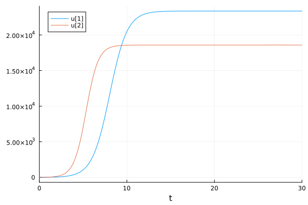
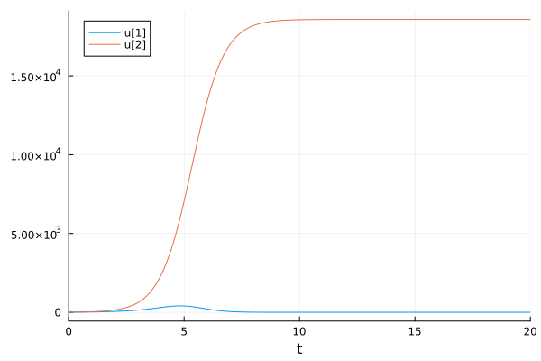
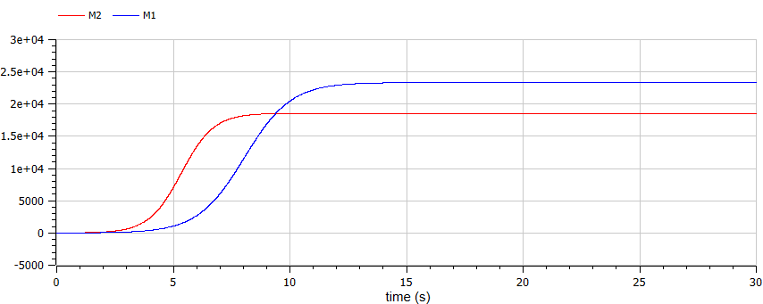
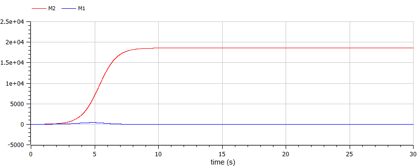

---
## Front matter
lang: ru-RU
title: Лабораторная работа №8
subtitle: Модель конкуренции двух фирм
author:
  - Маслова А. С.
institute:
  - Российский университет дружбы народов, Москва, Россия
date: 30 марта 2024

## i18n babel
babel-lang: russian
babel-otherlangs: english

## Formatting pdf
toc: false
toc-title: Содержание
slide_level: 2
aspectratio: 169
section-titles: true
theme: metropolis
header-includes:
 - \metroset{progressbar=frametitle,sectionpage=progressbar,numbering=fraction}
 - '\makeatletter'
 - '\beamer@ignorenonframefalse'
 - '\makeatother'
---

# Информация

## Докладчик

:::::::::::::: {.columns align=center}
::: {.column width="70%"}

  * Маслова Анастасия Сергеевна
  * студентка группы НКНбд-01-21
  * Российский университет дружбы народов
  * [1032216455@rudn.ru](mailto:1032216455@rudn.ru)
  * <https://github.com/asmaslova/>

:::
::: {.column width="30%"}


:::
::::::::::::::

# Цель работы

## Цель работы

Построить модели конкуренции двух фирм и Постройте графики изменения оборотных средств фирмы 1 и фирмы 2 без учета постоянных издержек и с веденной нормировкой.

# Задание

## Вариант 26

Случай 1. Рассмотрим две фирмы, производящие взаимозаменяемые товары одинакового качества и находящиеся в одной рыночной нише. Считаем, что в рамках нашей модели конкурентная борьба ведётся только рыночными методами. То есть, конкуренты могут влиять на противника путем изменения параметров своего производства: себестоимость, время цикла, но не могут прямо вмешиваться в ситуацию на рынке («назначать» цену или влиять на потребителей каким-либо иным способом.) Будем считать, что постоянные издержки пренебрежимо малы, и в модели учитывать не будем. В этом случае динамика изменения объемов продаж фирмы 1 и фирмы 2 описывается следующей системой уравнений:

$$ \frac{dM_1}{d\theta} = M_1 - \frac{b}{c_1} M_1 M_2 - \frac{a_1}{c_1}M_1^2 $$ 

$$ \frac{dM2}{d\theta} = \frac{c_2}{c_1}M2 - \frac{b}{c_1} M_1 M_2 - \frac{a_2}{c_1}M_2^2 $$ 

$\text{где } a_1 = \frac{p_cr}{\tau^2_1\tilde{p^2_1}Nq} \text{, } a_2 = \frac{p_cr}{\tau^2_2\tilde{p^2_2}Nq} \text{, } b = \frac{p_cr}{\tau^2_1\tilde{p^2_1}\tau^2_2\tilde{p^2_2}Nq} \text{, } c_1 = \frac{p_cr - \tilde{p_1}}{\tau_1 \tilde{p_1}} \text{, } c_2 = \frac{p_cr - \tilde{p_2}}{\tau_2 \tilde{p_2}} \text{.}$

$\text{Также введена нормировка } t = c_1 * \theta \text{.}$

## Вариант 26

Случай 2. Рассмотрим модель, когда, помимо экономического фактора влияния (изменение себестоимости, производственного цикла, использование кредита и т.п.), используются еще и социально-психологические факторы – формирование общественного предпочтения одного товара другому, не зависимо от их качества и цены. В этом случае взаимодействие двух фирм будет зависеть друг от друга, соответственно коэффициент перед $ M_1 M_2 $ будет отличаться. Пусть в рамках рассматриваемой модели динамика изменения объемов продаж фирмы 1 и фирмы 2 описывается следующей системой уравнений:

$$ \frac{dM_1}{d\theta} = M_1 - (\frac{b}{c_1} + 0.00016) M_1 M_2 - \frac{a_1}{c_1}M_1^2 $$ 

$$ \frac{dM2}{d\theta} = \frac{c_2}{c_1}M2 - \frac{b}{c_1} M_1 M_2 - \frac{a_2}{c_1}M_2^2 $$

Для обоих случаев рассмотрим задачу со следующими начальными условиями и параметрами:

$$ M^1_0 = 7.5, M^2_0 = 8.5, p_cr = 40, N = 95, q = 1, \tau_1 = 30, \tau_2 = 27, \tilde{p_1} = 11.5, \tilde{p_2} = 9.5 $$

Замечание: Значения $p_cr$, $\tilde{p_{1,2}}$, $N$ указаны в тысячах единиц, а значения $M_{1,2}$ указаны в млн. единиц.

## Вариант 26

Обозначения:

$N$ – число потребителей производимого продукта.

$\tau$ – длительность производственного цикла

$p$ – рыночная цена товара

$\tilde{p}$ – себестоимость продукта, то есть переменные издержки на производство единицы продукции.

$q$ – максимальная потребность одного человека в продукте в единицу времени

$\theta = \frac{t}{c_1}$ - безразмерное время

## Вариант 26

1. Постройте графики изменения оборотных средств фирмы 1 и фирмы 2 без учета постоянных издержек и с веденной нормировкой для случая 1.
2. Постройте графики изменения оборотных средств фирмы 1 и фирмы 2 без учета постоянных издержек и с веденной нормировкой для случая 2.

# Выполнение работы

## Код на языке Julia

```Julia
p_cr = 40
tau1 = 30
tau2 = 27
p1 = 11.5
p2 = 9.5
N = 95
q = 1
tspan = (0, 20)
const1 = 0
const2 = 0.00016
u0 = [7.5, 8.5]

a1 = p_cr/(tau1*tau1*p1*p1*N*q)
a2 = p_cr/(tau2*tau2*p2*p2*N*q)
b = p_cr/(tau1*tau1*p1*p1*tau2*tau2*p2*p2*N*q)
c1 = (p_cr - p1)/(tau1*p1)
c2 = (p_cr - p2)/(tau2*p2)

p1 = [a1, a2, b, c1, c2, const1]
p2 = [a1, a2, b, c1, c2, const2]
```

## Код на языке Julia

```Julia
function syst(du,u,p,t)
    a1, a2, b, c1, c2, constant = p
    du[1] = u[1] - ((b/c1) + constant)*u[1]*u[2] - (a1/c1)*u[1]*u[1]
    du[2] = (c2/c1)*u[2] - (b/c1)*u[1]*u[2] - (a2/c1)*u[2]*u[2]
end

problem1 = ODEProblem(syst, u0, tspan, p1)
solution1 = solve(problem1, Tsit5())

problem2 = ODEProblem(syst, u0, tspan, p2)
solution2 = solve(problem2, Tsit5())

plot(solution2)
```

## Результат работы кода

{#fig:001 width=70%}

## Результат работы кода

{#fig:002 width=70%}

## Код для среды OpenModelica

```Modelica
model lab8
Real M1(start=7.5);
Real M2(start=8.5);

parameter Real p_cr = 40;
parameter Real tau1 = 30;
parameter Real tau2 = 27;
parameter Real p1 = 11.5;
parameter Real p2 = 9.5;
parameter Real N = 95;
parameter Real q = 1;
parameter Real a1 = p_cr/(tau1*tau1*p1*p1*N*q);
parameter Real a2 = p_cr/(tau2*tau2*p2*p2*N*q);
parameter Real b = p_cr/(tau1*tau1*p1*p1*tau2*tau2*p2*p2*N*q);
parameter Real c1 = (p_cr - p1)/(tau1*p1);
parameter Real c2 = (p_cr - p2)/(tau2*p2);

equation

der(M1) = M1 - (b/c1)*M1*M2 - (a1/c1)*M1*M1;
der(M2) = (c2/c1)*M2 - (b/c1)*M1*M2 - (a2/c1)*M2*M2;

end lab8;
```

## Код для среды OpenModelica

```Modelica
model lab8
Real M1(start=7.5);
Real M2(start=8.5);

parameter Real p_cr = 40;
parameter Real tau1 = 30;
parameter Real tau2 = 27;
parameter Real p1 = 11.5;
parameter Real p2 = 9.5;
parameter Real N = 95;
parameter Real q = 1;
parameter Real a1 = p_cr/(tau1*tau1*p1*p1*N*q);
parameter Real a2 = p_cr/(tau2*tau2*p2*p2*N*q);
parameter Real b = p_cr/(tau1*tau1*p1*p1*tau2*tau2*p2*p2*N*q);
parameter Real c1 = (p_cr - p1)/(tau1*p1);
parameter Real c2 = (p_cr - p2)/(tau2*p2);

equation

der(M1) = M1 - ((b/c1)+0.00016)*M1*M2 - (a1/c1)*M1*M1;
der(M2) = (c2/c1)*M2 - (b/c1)*M1*M2 - (a2/c1)*M2*M2;

end lab8;
```

## Результат работы кода

{#fig:003 width=70%}

## Результат работы кода

{#fig:004 width=70%}

# Вывод

## Вывод

В ходе лабораторной работы я построила модель конкуренции двух фирм на языке Julia и в среде OpenModelica.