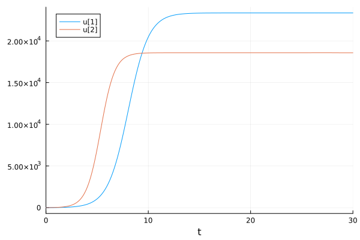
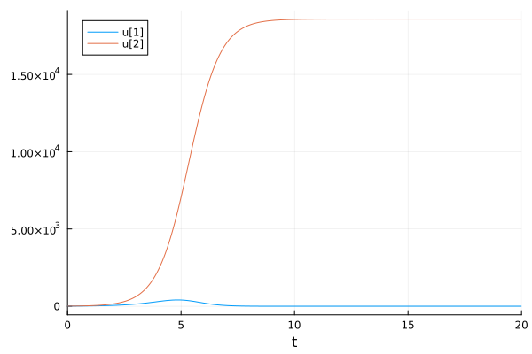
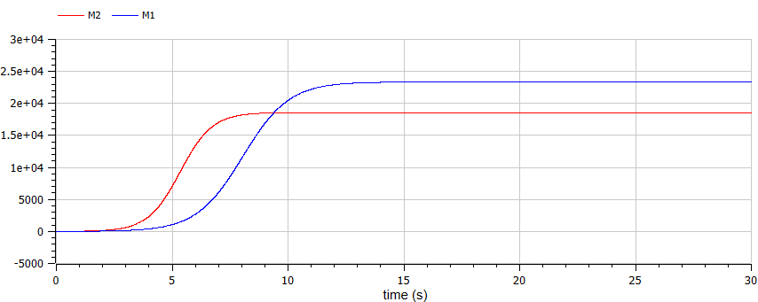
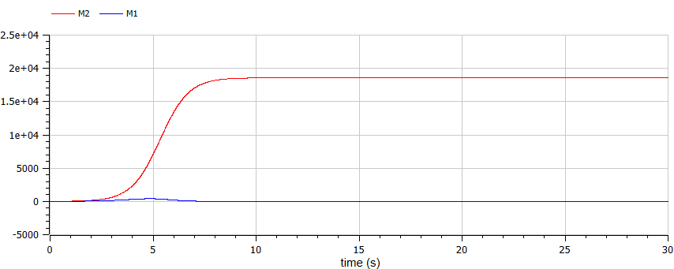

---
## Front matter
title: "Лабораторная работа №8"
subtitle: "Модель конкуренции двух фирм"
author: "Маслова Анастасия Сергеевна"

## Generic otions
lang: ru-RU
toc-title: "Содержание"

## Bibliography
bibliography: bib/cite.bib
csl: pandoc/csl/gost-r-7-0-5-2008-numeric.csl

## Pdf output format
toc: true # Table of contents
toc-depth: 2
lof: true # List of figures
lot: true # List of tables
fontsize: 12pt
linestretch: 1.5
papersize: a4
documentclass: scrreprt
## I18n polyglossia
polyglossia-lang:
  name: russian
  options:
	- spelling=modern
	- babelshorthands=true
polyglossia-otherlangs:
  name: english
## I18n babel
babel-lang: russian
babel-otherlangs: english
## Fonts
mainfont: PT Serif
romanfont: PT Serif
sansfont: PT Sans
monofont: PT Mono
mainfontoptions: Ligatures=TeX
romanfontoptions: Ligatures=TeX
sansfontoptions: Ligatures=TeX,Scale=MatchLowercase
monofontoptions: Scale=MatchLowercase,Scale=0.9
## Biblatex
biblatex: true
biblio-style: "gost-numeric"
biblatexoptions:
  - parentracker=true
  - backend=biber
  - hyperref=auto
  - language=auto
  - autolang=other*
  - citestyle=gost-numeric
## Pandoc-crossref LaTeX customization
figureTitle: "Рис."
tableTitle: "Таблица"
listingTitle: "Листинг"
lofTitle: "Список иллюстраций"
lotTitle: "Список таблиц"
lolTitle: "Листинги"
## Misc options
indent: true
header-includes:
  - \usepackage{indentfirst}
  - \usepackage{float} # keep figures where there are in the text
  - \floatplacement{figure}{H} # keep figures where there are in the text
---

# Цель работы

Построить модели конкуренции двух фирм и Постройте графики изменения оборотных средств фирмы 1 и фирмы 2 без учета постоянных издержек и с веденной нормировкой.

# Задание

Вариант 26

Случай 1. Рассмотрим две фирмы, производящие взаимозаменяемые товары одинакового качества и находящиеся в одной рыночной нише. Считаем, что в рамках нашей модели конкурентная борьба ведётся только рыночными методами. То есть, конкуренты могут влиять на противника путем изменения параметров своего производства: себестоимость, время цикла, но не могут прямо вмешиваться в ситуацию на рынке («назначать» цену или влиять на потребителей каким-либо иным способом.) Будем считать, что постоянные издержки пренебрежимо малы, и в модели учитывать не будем. В этом случае динамика изменения объемов продаж фирмы 1 и фирмы 2 описывается следующей системой уравнений:

$$ \frac{dM_1}{d\theta} = M_1 - \frac{b}{c_1} M_1 M_2 - \frac{a_1}{c_1}M_1^2 $$ 

$$ \frac{dM2}{d\theta} = \frac{c_2}{c_1}M2 - \frac{b}{c_1} M_1 M_2 - \frac{a_2}{c_1}M_2^2 $$ 

$\text{где } a_1 = \frac{p_cr}{\tau^2_1\tilde{p^2_1}Nq} \text{, } a_2 = \frac{p_cr}{\tau^2_2\tilde{p^2_2}Nq} \text{, } b = \frac{p_cr}{\tau^2_1\tilde{p^2_1}\tau^2_2\tilde{p^2_2}Nq} \text{, } c_1 = \frac{p_cr - \tilde{p_1}}{\tau_1 \tilde{p_1}} \text{, } c_2 = \frac{p_cr - \tilde{p_2}}{\tau_2 \tilde{p_2}} \text{.}$

$\text{Также введена нормировка } t = c_1 * \tetha \text{.}$

Случай 2. Рассмотрим модель, когда, помимо экономического фактора влияния (изменение себестоимости, производственного цикла, использование кредита и т.п.), используются еще и социально-психологические факторы – формирование общественного предпочтения одного товара другому, не зависимо от их качества и цены. В этом случае взаимодействие двух фирм будет зависеть друг от друга, соответственно коэффициент перед $ M_1 M_2 $ будет отличаться. Пусть в рамках рассматриваемой модели динамика изменения объемов продаж фирмы 1 и фирмы 2 описывается следующей системой уравнений:

$$ \frac{dM_1}{d\theta} = M_1 - (\frac{b}{c_1} + 0.00016) M_1 M_2 - \frac{a_1}{c_1}M_1^2 $$ 

$$ \frac{dM2}{d\theta} = \frac{c_2}{c_1}M2 - \frac{b}{c_1} M_1 M_2 - \frac{a_2}{c_1}M_2^2 $$

Для обоих случаев рассмотрим задачу со следующими начальными условиями и параметрами:

$$ M^1_0 = 7.5, M^2_0 = 8.5, p_cr = 40, N = 95, q = 1, \tau_1 = 30, \tau_2 = 27, \tilde{p_1} = 11.5, \tilde{p_2} = 9.5 $$

Замечание: Значения $p_cr$, $\tilde{p_{1,2}}$, $N$ указаны в тысячах единиц, а значения $M_{1,2}$ указаны в млн. единиц.

Обозначения:

$N$ – число потребителей производимого продукта.

$\tau$ – длительность производственного цикла

$p$ – рыночная цена товара

$\tilde{p}$ – себестоимость продукта, то есть переменные издержки на производство единицы продукции.

$q$ – максимальная потребность одного человека в продукте в единицу времени

$\theta = \frac{t}{c_1}$ - безразмерное время

1. Постройте графики изменения оборотных средств фирмы 1 и фирмы 2 без учета постоянных издержек и с веденной нормировкой для случая 1.
2. Постройте графики изменения оборотных средств фирмы 1 и фирмы 2 без учета постоянных издержек и с веденной нормировкой для случая 2.

# Теоретическое введение

Для построения модели конкуренции хотя бы двух фирм необходимо рассмотреть модель одной фирмы. Вначале рассмотрим модель фирмы, производящей продукт долговременного пользования, когда цена его определяется балансом спроса и предложения. Примем, что этот продукт занимает определенную нишу рынка и конкуренты в ней отсутствуют.

Обозначим:

N – число потребителей производимого продукта.

S – доходы потребителей данного продукта. Считаем, что доходы всех потребителей одинаковы. Это предположение справедливо, если речь идет об одной рыночной нише, т.е. производимый продукт ориентирован на определенный слой населения.

$M$ – оборотные средства предприятия

$\tau$ – длительность производственного цикла

$p$ – рыночная цена товара

$\tilde{p}$ – себестоимость продукта, то есть переменные издержки на производство единицы продукции.

$\delta$ – доля оборотных средств, идущая на покрытие переменных издержек.

$\kappa$ – постоянные издержки, которые не зависят от количества выпускаемой продукции.

$Q(S/p)$ – функция спроса, зависящая от отношения дохода $S$ к цене $p$. Она равна количеству продукта, потребляемого одним потребителем в единицу времени.

Функцию спроса товаров долговременного использования часто
представляют в простейшей форме:

$$Q = q - k \frac{p}{S} = q(1 - \frac{p}{p_cr}) \text{  (1)}$$

где $q$ – максимальная потребность одного человека в продукте в единицу времени. Эта функция падает с ростом цены и при $p = p_cr$ (критическая стоимость продукта) потребители отказываются от приобретения товара. Величина $p_cr = Sq/k$. Параметр $k$ – мера эластичности функции спроса по цене. Таким образом, функция спроса в форме (1) является пороговой (то есть, $Q(S/p) = 0$ при $p \geq p_cr$) и обладает свойствами насыщения.

Более подробно об Unix см. в [@lab:bash].

# Выполнение лабораторной работы

Для начала я построила обе модели на языке программирования Julia. Сначала я задала начальные параметры:

```Julia
p_cr = 40
tau1 = 30
tau2 = 27
p1 = 11.5
p2 = 9.5
N = 95
q = 1
tspan = (0, 20)
const1 = 0
const2 = 0.00016
u0 = [7.5, 8.5]

a1 = p_cr/(tau1*tau1*p1*p1*N*q)
a2 = p_cr/(tau2*tau2*p2*p2*N*q)
b = p_cr/(tau1*tau1*p1*p1*tau2*tau2*p2*p2*N*q)
c1 = (p_cr - p1)/(tau1*p1)
c2 = (p_cr - p2)/(tau2*p2)

p1 = [a1, a2, b, c1, c2, const1]
p2 = [a1, a2, b, c1, c2, const2]
```

Затем я составила систему уравнений, решила ее и построила графики:

```Julia
function syst(du,u,p,t)
    a1, a2, b, c1, c2, constant = p
    du[1] = u[1] - ((b/c1) + constant)*u[1]*u[2] - (a1/c1)*u[1]*u[1]
    du[2] = (c2/c1)*u[2] - (b/c1)*u[1]*u[2] - (a2/c1)*u[2]*u[2]
end

problem1 = ODEProblem(syst, u0, tspan, p1)
solution1 = solve(problem1, Tsit5())

problem2 = ODEProblem(syst, u0, tspan, p2)
solution2 = solve(problem2, Tsit5())

plot(solution2)
```

График для первого случая получился вот такой (рис. @fig:001):

{#fig:001 width=70%}

График для второго случая выглядит следующим образом (рис. @fig:002):

{#fig:002 width=70%}

Затем я построила эту же модель, но в среде OpenModelica. Код для первого случая выглядел следующим образом:

```Modelica
model lab8
Real M1(start=7.5);
Real M2(start=8.5);

parameter Real p_cr = 40;
parameter Real tau1 = 30;
parameter Real tau2 = 27;
parameter Real p1 = 11.5;
parameter Real p2 = 9.5;
parameter Real N = 95;
parameter Real q = 1;
parameter Real a1 = p_cr/(tau1*tau1*p1*p1*N*q);
parameter Real a2 = p_cr/(tau2*tau2*p2*p2*N*q);
parameter Real b = p_cr/(tau1*tau1*p1*p1*tau2*tau2*p2*p2*N*q);
parameter Real c1 = (p_cr - p1)/(tau1*p1);
parameter Real c2 = (p_cr - p2)/(tau2*p2);

equation

der(M1) = M1 - (b/c1)*M1*M2 - (a1/c1)*M1*M1;
der(M2) = (c2/c1)*M2 - (b/c1)*M1*M2 - (a2/c1)*M2*M2;

end lab8;
```

В результате получился следующий график (рис. @fig:003):

{#fig:003 width=70%}

Затем я построила график для второго случая с помощью данного кода:

```Modelica
model lab8
Real M1(start=7.5);
Real M2(start=8.5);

parameter Real p_cr = 40;
parameter Real tau1 = 30;
parameter Real tau2 = 27;
parameter Real p1 = 11.5;
parameter Real p2 = 9.5;
parameter Real N = 95;
parameter Real q = 1;
parameter Real a1 = p_cr/(tau1*tau1*p1*p1*N*q);
parameter Real a2 = p_cr/(tau2*tau2*p2*p2*N*q);
parameter Real b = p_cr/(tau1*tau1*p1*p1*tau2*tau2*p2*p2*N*q);
parameter Real c1 = (p_cr - p1)/(tau1*p1);
parameter Real c2 = (p_cr - p2)/(tau2*p2);

equation

der(M1) = M1 - ((b/c1)+0.00016)*M1*M2 - (a1/c1)*M1*M1;
der(M2) = (c2/c1)*M2 - (b/c1)*M1*M2 - (a2/c1)*M2*M2;

end lab8;
```

В результате получился следующий график (рис. @fig:004):

{#fig:004 width=70%}

# Выводы

В ходе лабораторной работы я построила модель конкуренции двух фирм на языке Julia и в среде OpenModelica.

# Список литературы{.unnumbered}

::: {#refs}
:::
