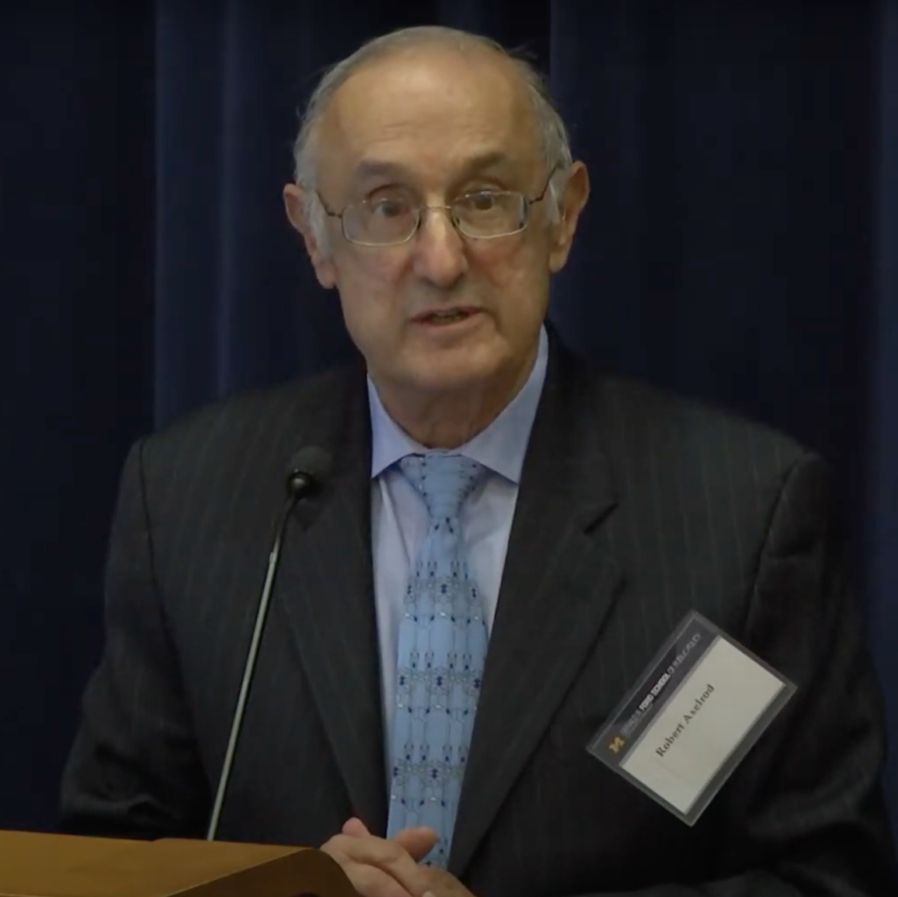
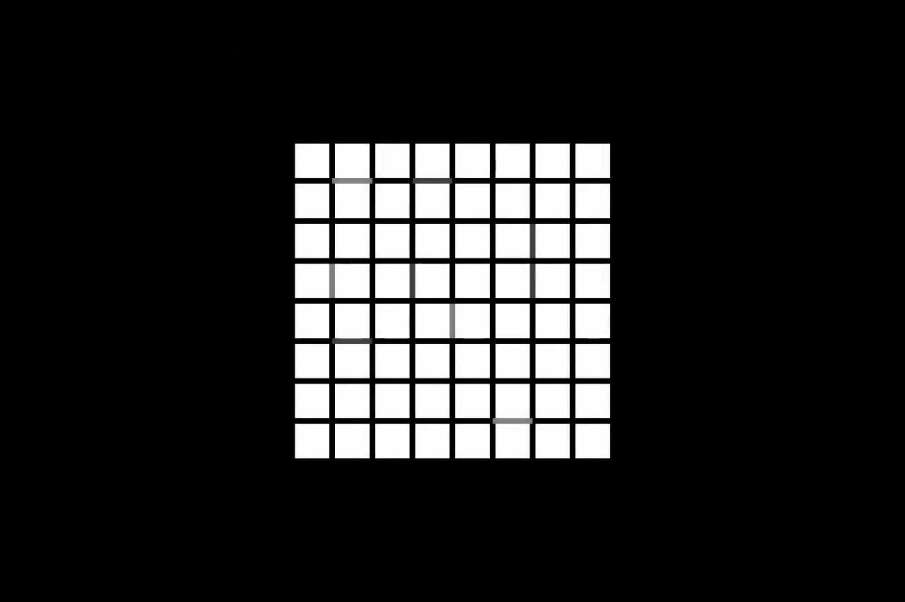
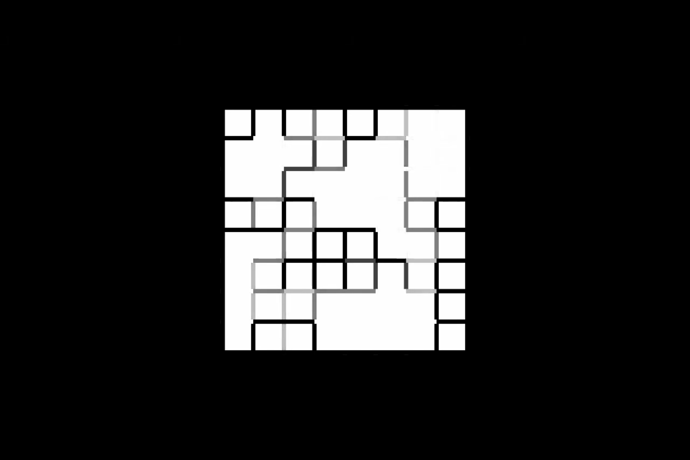
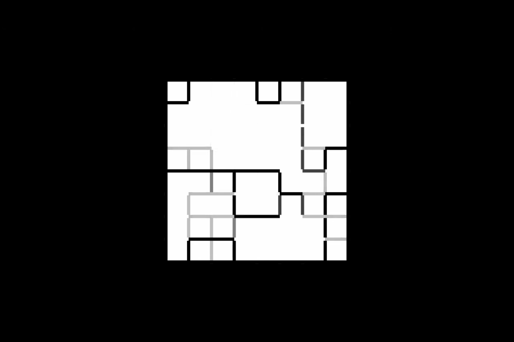
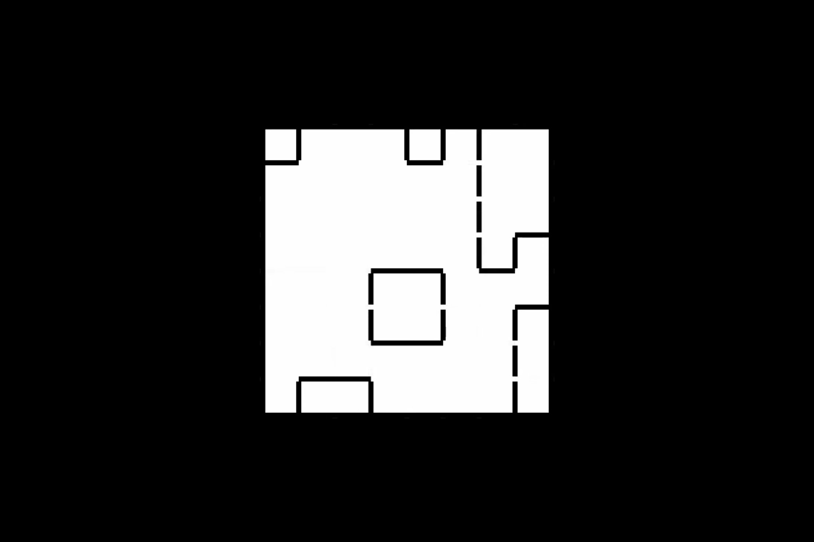

---
## Front matter
lang: ru-RU
title: Модель Аксельрода
subtitle:
author:
  - Маслова А. С.
institute:
  - Российский университет дружбы народов, Москва, Россия
date: 7 марта 2024

## i18n babel
babel-lang: russian
babel-otherlangs: english

## Formatting pdf
toc: false
toc-title: Содержание
slide_level: 2
aspectratio: 169
section-titles: true
theme: metropolis
header-includes:
 - \metroset{progressbar=frametitle,sectionpage=progressbar,numbering=fraction}
 - '\makeatletter'
 - '\beamer@ignorenonframefalse'
 - '\makeatother'
---

# Информация

## Докладчик

:::::::::::::: {.columns align=center}
::: {.column width="70%"}

  * Маслова Анастасия Сергеевна
  * студентка НКНбд-01-21
  * Российский университет дружбы народов
  * [1032216455@pfur.ru](mailto:1032216455@pfur.ru)
  * <https://github.com/asmaslova/>

:::
::: {.column width="30%"}

:::
::::::::::::::

# Вводная часть

## Краткая биография

:::::::::::::: {.columns align=center}
::: {.column width="70%"}

  * Роберт Аксельрод (род. 27 мая 1943)
  * "The dissemination of culture: a model with local convergence and global polarization" (1997)

:::
::: {.column width="30%"}

:::
::::::::::::::

# Описание модели

## Модель

Представим, что каждый агент задается вектором из 5 значений, каждое из которых представляет собой какой-либо аспект культуры, например:

[1, 7, 2, 8, 9]

## Модель

Агенты $k$ и $r$ взаимодействуют с вероятностью, равной их культурному сходству, $n_kr/f$, где $n_kr$ обозначает количество культурных особенностей, для которых агенты $k$ и $r$ обладают одинаковыми признаками.

[1, 7, 2, 8, 9]

[3, 7, 2, 6, 1]

##

{#fig:001}

##

{#fig:002}

##

{#fig:003}

##

{#fig:004}

##

{#fig:005}

##

{#fig:006}

# Вывод

## Вывод

Модель Аксельрода зарекомендовала себя как ценный инструмент для понимания распространения культуры внутри обществ. Моделируя взаимодействие и обмен культурными чертами, эта модель позволяет исследователям понять динамику культурной эволюции и появление отдельных культурных регионов.